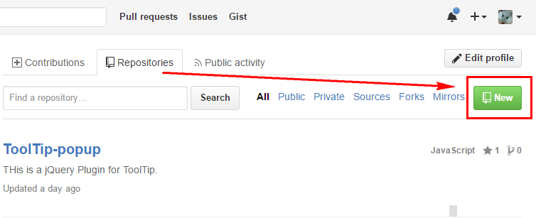
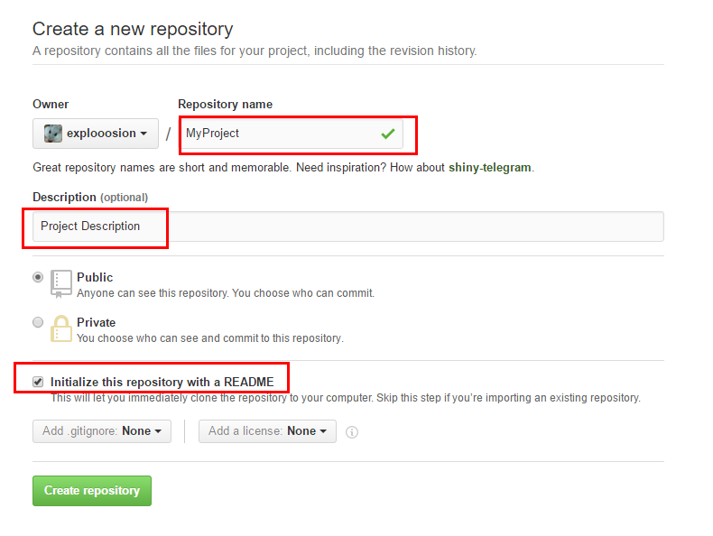
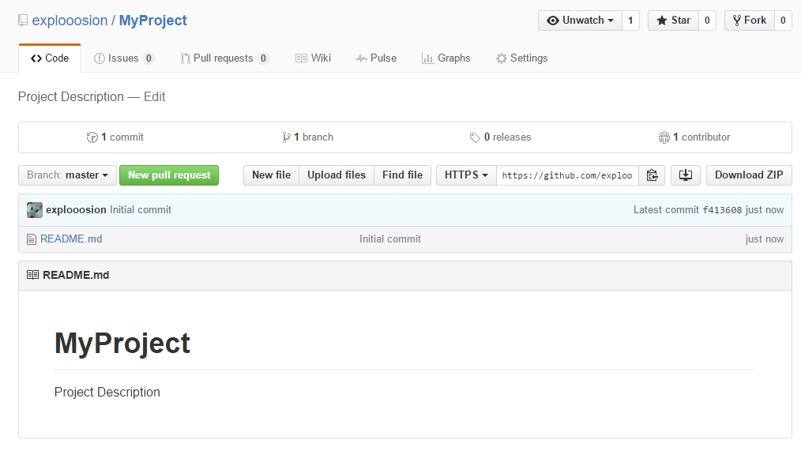
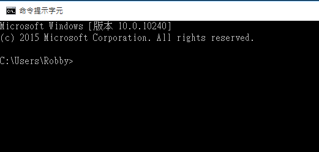
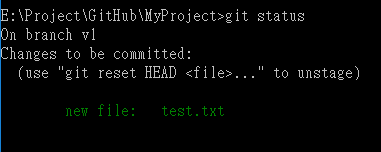
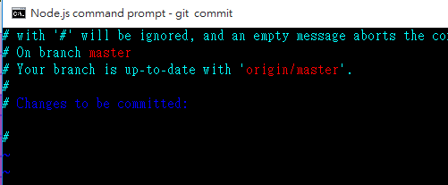
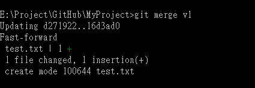
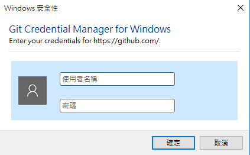
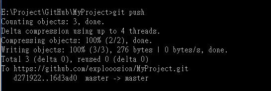
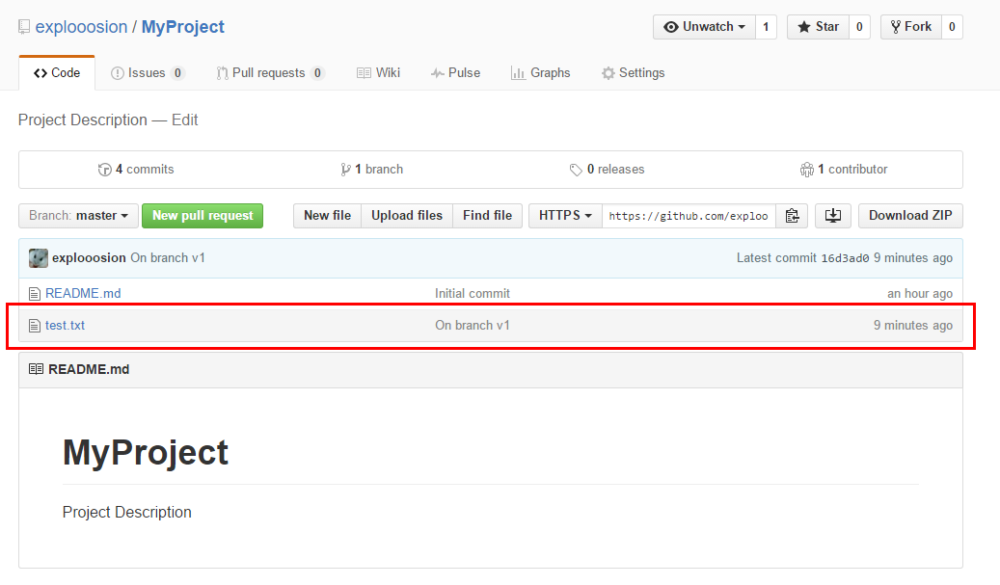

Git 版本控制新手教學，搭配 github ，請安心服用。

現在針對 code 版本控制越來越多，主流大概就是 [Git](https://git-scm.com/) 、 [TFS](https://www.visualstudio.com/zh-tw/products/tfs-overview-vs.aspx) ，

而小弟還在 [SourceAnyhere](http://www.dynamsoft.com/products/version-control-source-control-sourceanywhere.aspx) （垂頭），該考慮改使用 Git 了，

Git 最大特點就是屬於[分散式管理](https://git-scm.com/book/zh-tw/v1/%E9%96%8B%E5%A7%8B-%E9%97%9C%E6%96%BC%E7%89%88%E6%9C%AC%E6%8E%A7%E5%88%B6)，有別於傳統集中於伺服器管理。

前置作業
----

1.  安裝 [Git](https://git-scm.com/) 。
2.  申請 [GitHub](https://github.com/) 帳號。

建立專案
----

點選 Repositories，選擇 New。

​輸入名稱、描述，勾選【 Initialize this repository with a README 】。  

建立好後如下圖，可看見剛剛輸入的標題及描述。

複製 HTTPS網址，等等要作為下載之用，在 git 應用上稱為【 clone 】。

開啟本地電腦CMD。

利用 Git 指令設定名字，記得請加上雙引號。

    git config --global user.name "YourName"

設定個人Email。

    git config --global user.email "youremail@gmail.com"

然後利用【 [cd](http://lnpcd.blogspot.tw/2012/07/05.html) 】移動路徑到您要建立的專案位置，到該目錄底下後，

將剛剛建立好的 repository clone 於此。

    git clone https://github.com/explooosion/MyProject.git

如果有下載失敗，可到系統槽使用者帳戶底下，刪除【.gitconfig】設定，並重新安裝試試看。

下載完畢後，利用指令 cd 進入該目錄，可下指令查看當前狀態，會告訴你目前於 master 主幹上。

    git status

在該目錄中我們先建立一個新的 branch 名為 v1。

    git branch v1

然後切換分枝到 v1。

    git checkout v1

重新鍵入 git status，會告訴你目前在 v1 這個 branch 上： On branch v1

    git status

接下來請在目錄底下新增檔案，完成後利用 git add 加入剛剛的檔案。（這邊隨意新增檔案，名 test.txt）

PS. 請務必先有檔案出現，再鍵入 git add，這不是先有雞還是先有蛋的問題（搖頭）。 

    git add test.txt

完成加入後可利用剛剛 git status 查看狀態。

    git status

可以發現在 branch v1 上，有新檔案的加入：　new file

此時我們輸入常常聽到人家口中說的 commit 。

    git commit

輸入後會出現編輯模式，Windows 系統為 vim 編輯器，

不熟悉使用方法的朋友，可以到[鳥哥](http://linux.vbird.org/linux_basic/0310vi.php)這邊了解。

  
 

所有看到的項目皆是被註解的狀態【#】，可以看到 new file 這一欄被註解了，

鍵入  i ，進入 vim 編輯模式，可看到左下角提示 【 --  INSERT -- 】，然後將註姊 （欸） 拿掉。

    i

將【 # 】 Backspace 後，會發現整段不見了，是正常的，至於為什麼？

小弟也不是很清楚，可問問 [神奇海螺](http://lmgtfy.com/?q=git+commit) 。

鍵入 Esc 後，並輸入【:wq】 （含分號），表示儲存並離開， 

若想不儲存離開（即強迫關閉），請輸入【:q!】 （含分號）

    :wq

退出 vim 後，切換到 master （主要）上。

    git checkout master

將本次建立的 v1 merge 起來，系統會以【+】表示本次加入的檔案。

    git merge v1

push 到 GitHub 上。

    git push

此時會彈出登入視窗，為連入 github ，輸入好後【確定】。

PS. 僅有第一次使用才需要登入。

完成 push 後，會出現以下畫面，

這時快點到您的 [github](https://github.com/explooosion/MyProject) 上面看看，

恭喜成功～～～（灑花）

可以看到檔案 branch 在 v1 【On branch v1】

想刪除檔案怎麼辦？

前面步驟一樣，先切換至 v1，利用指令【 rm 】，對檔案進行刪除即可。

    git checkout v1

    git rm test.txt

之後再進行 commit，切換到 master 並 merge 一起。（[以上請至上面步驟參考](#merge)）

最後 push 即可。

    git push

以上相關教學為參考：[Git 筆記 - Git初始設定 & Github入門](http://tech.marsw.tw/blog/2013/08/16/git-notes-github)

有勘誤之處，不吝指教。ob'\_'ov