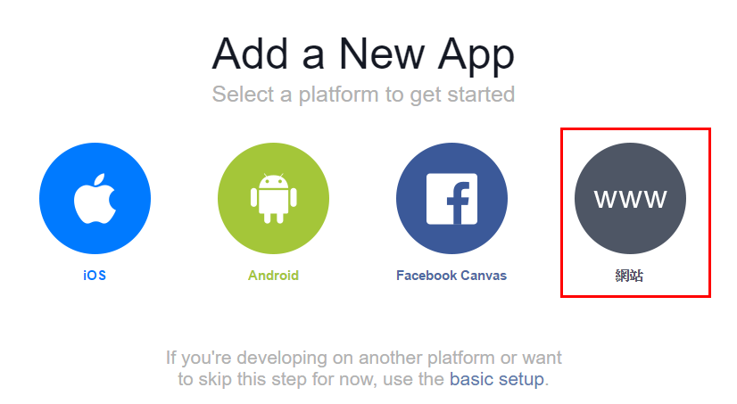
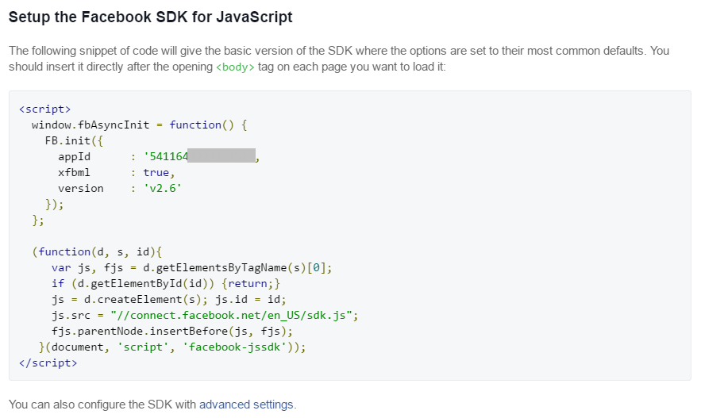
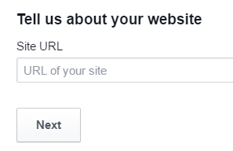
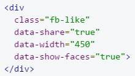
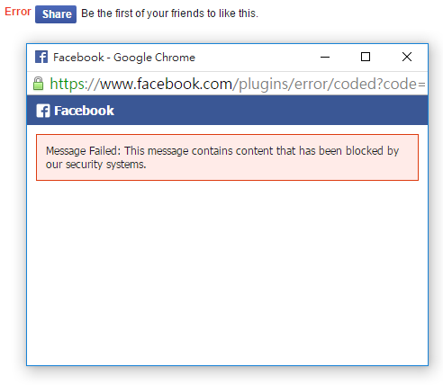
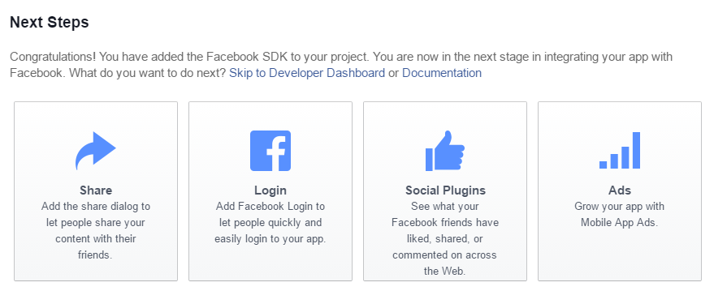
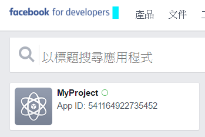

facebook api 新手教學之 login 應用，請安心服用。

現在許多網站都具有 Facebook 登入方式，甚至連遊戲也是，

本篇紀錄從「申請應用程式服務」到基本的登入 API 編寫。

前置作業
----

1.  新增應用程式。
2.  編寫  Facebook SDK。

新增應用程式
------

首先可到 facebook 的 [developers](https://developers.facebook.com/apps) 新增應用程式。

開發平台我們選擇網站。

輸入應用程式名稱，點選「Create New Facebook App ID」。

輸入電子郵件，選擇參考，

因為是新建立，故測試版本保持「否」。

完成建立後可看到進度「Setup SDK」

網頁編寫
----

捲下來看，可看到基本的 Facebook SDK JS。

下方輸入要嵌入 Facebook SDK 的網站。

若為本機測試，可輸入 [http://localhost/](http://localhost/)

完成後會跳出 fb 按讚留言的 div

建立一個空白網頁，並將剛剛 JS 及 div 加入於內容中

即可建立一個簡易讚 + 分享 的功能。

若為本機測試，在「Like」部份則可能會有點問題

以上測試順利後，選擇「 Login」查看文件。

登入 Login
--------

進入頁面後，可從「快速入門」著手，並將範例程式碼編寫於網頁中。

    <!DOCTYPE html>
    <html>
    <head>
    <title>Facebook Login JavaScript Example</title>
    <meta charset="UTF-8">
    </head>
    <body>
    
    
    <!--
      Below we include the Login Button social plugin. This button uses
      the JavaScript SDK to present a graphical Login button that triggers
      the FB.login() function when clicked.
    -->
    
    <fb:login-button scope="public_profile,email" onlogin="checkLoginState();">
    </fb:login-button>
    
    

    

    
    </body>
    </html>

  
 

在 appId 中： { your-app-id } ，為本應用程式的應用程式編號，可回到[應用程式專區](https://developers.facebook.com/apps)查看。

     window.fbAsyncInit = function() {
      FB.init({
        appId      : '{your-app-id}',
        cookie     : true,  // enable cookies to allow the server to access 
                            // the session
        xfbml      : true,  // parse social plugins on this page
        version    : 'v2.2' // use version 2.2
      });

完成後即可看到 Log In 按鈕。

在網頁載時，會先執行 FB.getLoginStatus，

並且進入 statusChangeCallback 這個 function

    FB.getLoginStatus(function(response) {
        statusChangeCallback(response);
    });

若要讓使用者登出，FB.logout 即可。

    FB.logout(function(response) {
                        // user is now logged out
                        alert('已成功登出!');
                        window.location.reload();
                    });

有勘誤之處，不吝指教。ob'\_'ov