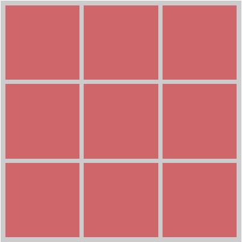

css3 之 calc 計算功能，請安心服用。

如果今天要寫出格子狀的樣式，

除了要計算每個小格子寬度外，還要計算它的間距。

但是難免會有小數點算不完的情形，

這時可用 CSS3 中的 calc 去進行算數運算。

【calc支援說明】 
-----------

**瀏覽器**

IE10+、Firefox4+、Chrome19+、Safari6+

**運算**

\+ - \* /

**單位**

px、em、rem、%

**計算**

複合式計算

以下範例可呈現出圖中效果，

每個小格子大小及其間距都相同。

靠左浮動排列
------

    .box{
      float: left;
    }

寬高設定
----

切成三等份，並扣除 10px 留給間距。

    .box{
      width: calc(100%/3 - 10px);
      height: calc(100%/3 - 10px);
    }

間距設定
----

    .box{
      margin-left: calc(5px * 3 / 2);
      margin-top: calc(5px * 3 / 2);
    }

程式結果
----

[CodePen](http://codepen.io/ta7382/pen/vKONVg)

參考資訊
----

[MINWT](http://www.minwt.com/webdesign-dev/css/11583.html)

有勘誤之處，不吝指教。ob'\_'ov