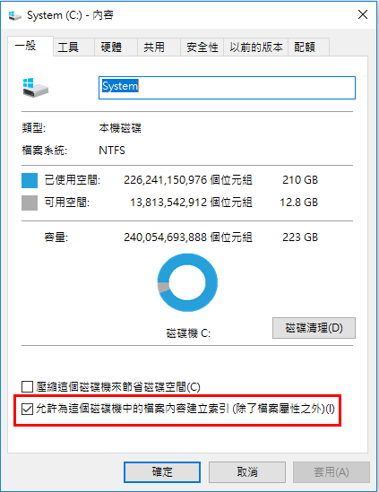
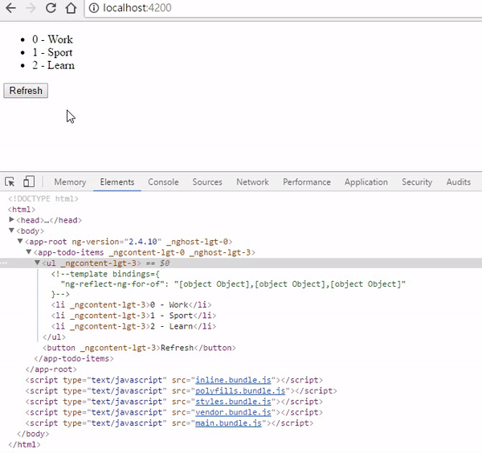
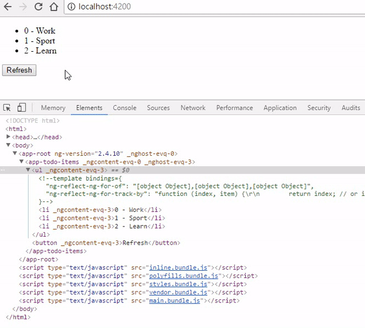

針對 angular（angular2）中 \*ngFor 補充說明。

一、前言
----

最近在搞 angular 的 ngFor 十分苦惱，

搞了很久總算稍微釐清一點。

二、ngFor
-------

在 angular 的 ngFor 中，我們常常這樣寫

【TypeScript】

    private items = [];  
    　
    constructor() {
       this.items= [{ name: 'work' }, { name: 'sport' }, { name: 'learn' }];
    }

【View】

    <ul>
      <li *ngFor="let item of items">
      {{ item.name }}
      </li>
    </ul>

【Result 】

    work
    sport
    learn

但為什麼要多個\*呢?

為了釐清這個問題，找尋了許多資源 QQ

所謂的 \*ngFor 是簡寫語法糖，即簡寫語法。其展開後如下：

【View】

    <ul>
      <template ngFor let-item [ngForOf]="items" [ngForTrackBy]="trackByFn" let-i="index">
        <li>
         {{ item.name }}
        </li>
      </template>
    </ul>

ngFor 可以看成三大塊，最前面的部分沒什麼問題，即從 items 集合中取出至 item，

而最後面的部份其實就是 key 值，例如我們在 li 的部分追加：

【View】

    <li>
    {{ i }} - {{ item.name }}
    </li>

就會取得該項次的索引值： 

【Result 】

    0 - work
    1 - sport
    2 - learn

而 ngForTrackBy 是什麼呢 ?

顧名思義跟索引有關係，能夠告知目前的資料流結構等等。

個人另一種想法就是跟我們常見的磁碟機的索引是一樣的。

三、不使用 ngForTrackBy
------------------

而這個要如何使用呢，實際上這已經屬於 **performance** 的層級了！

首先我們試著寫出動態新增，當按鈕點擊時，讓 items 再增加資料：

【View】

    <ul>
      <template ngFor let-item [ngForOf]="items" let-i="index">
        <li>
         {{ item.name }}
        </li>
      </template>
    </ul>
    
    <button (click)="getItems()">Refresh</button>

【TypeScript】

    export class TodoItemsComponent {
    
      private items = [];
    
      constructor() {
        this.items = [{ name: 'Work' }, { name: 'Sport' }, { name: 'Learn' }];
      }
    
      getItems() {
        this.items = this.getItemsFromServer();
      }
    
      getItemsFromServer() {
        return [{ name: 'Work' }, { name: 'Sport' }, { name: 'Learn' }, { name: 'Class' }, { name: 'Game' }, { name: 'Sleep' }, { name: 'Teach' }];
      }
    }
    

當 click event 觸發，getItems() 會重新取得資料，

這邊的 getItemsFromServer() 就是從資料庫中取得資料，

像是我們常用的資料重載刷新、搜尋功能，或是搭配 ajax 等等。

因此 getItemsFromServer 回傳了一串新資料（假的資料喇！），

並且指定給 items 集合，如此一來就可以實現動態新增。

執行結果看起來很正常，沒什麼特別的，畫面如下：

【Result 】

三、使用 ngForTrackBy
-----------------

接下來我們改使用 trackby，增加我們的 ngFor 參數。

\[ngForTrackBy\]="trackByFn"

【View】 

    <ul>
      <template ngFor let-item [ngForOf]="items" [ngForTrackBy]="trackByFn" let-i="index">
        <li>{{i}} - {{ item.name }}</li>
      </template>
    </ul>
    
    <button (click)="getItems()">Refresh</button>

【TypeScript】

    export class TodoItemsComponent {
    
      private items = [];
    
      constructor() {
        this.items = [{ name: 'Work' }, { name: 'Sport' }, { name: 'Learn' }];
      }
    
      trackByFn(index, item) {
        return index; // or item.name
      }
    
      getItems() {
        this.items = this.getItemsFromServer();
      }
    
      getItemsFromServer() {
        return [{ name: 'Work' }, { name: 'Sport' }, { name: 'Learn' }, { name: 'Class' }, { name: 'Game' }, { name: 'Sleep' }, { name: 'Teach' }];
      }
    }

當執行 ngFor 的時候，ngForTrackBy 會執行 function，

 trackByFn() 返回 index 作為 track，埋下日後不可挽回種子的感覺 ob'\_'ov （欸這裡是好事啊啊啊）

執行結果看起來很正常，沒什麼特別的......

在 debug mode 中也可以看到註解的：

"ng-reflect-ng-for-track-by": "function (index, item) {\\r\\n        return index; // or item.id\\r\\n    }"

真的只是這樣嗎？

請仔細看看 debug mode 中的 elements 區塊！！

是否有發現，既有的 DOM 不會被 **refresh**，在取得新資料後，只有 key 3~6 被載入，

而原本的 ０~2 不會因為 ngFor 的重新執行，導致被移除於DOM之外。

四、使用 \*ngFor 
-------------

上述發現差異後，我們趕緊回來使用較為簡潔的寫法 \*ngFor，

其大同小異，ngForTrackBy 改以使用 trackBy。

    <ul>
      <li *ngFor="let item of items ; trackBy:trackByFn ; let i=index">{{i}} - {{ item.name }}</li>
    </ul>
    <button (click)="getItems()">Refresh</button>

五、結論
----

個人認為，非特定的資料不一定要使用 trackby，

但清單若會因為一些邏輯功能，使得資料不斷的 reload，

對於 trackby 的使用，就十分重要了。

參考資料：

1.  [\[译\]Angular2新人常犯的5个错误](https://leftstick.github.io/tech/2016/04/19/5-rookie-mistakes-to-avoid-with-angular-2)
2.  [5 Rookie Mistakes to Avoid with Angular 2](http://angularjs.blogspot.tw/2016/04/5-rookie-mistakes-to-avoid-with-angular.html)
3.  [angular.io](https://angular.io/docs/ts/latest/guide/template-syntax.html#!#ngFor)
4.  [Angular 2 — Improve performance with trackBy](https://netbasal.com/angular-2-improve-performance-with-trackby-cc147b5104e5)

備註：

本篇範例部分修改自 - [Angular 2 — Improve performance with trackBy](https://netbasal.com/angular-2-improve-performance-with-trackby-cc147b5104e5)

有勘誤之處，不吝指教。ob'\_'ov