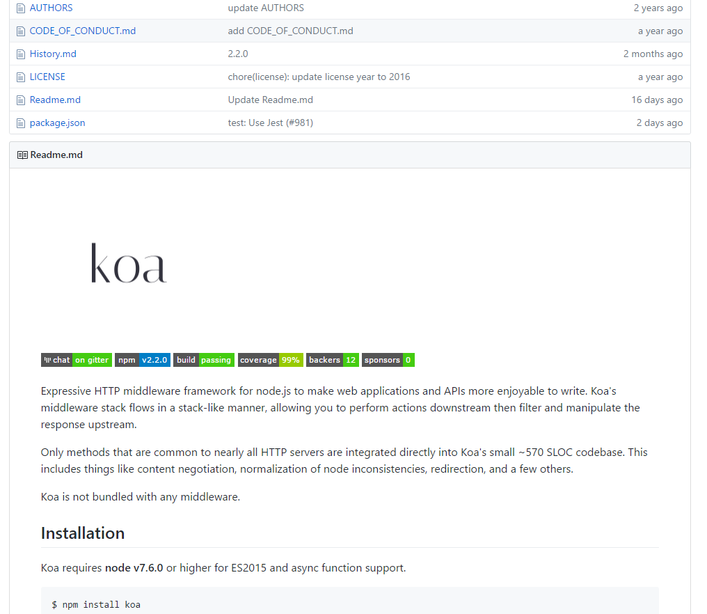
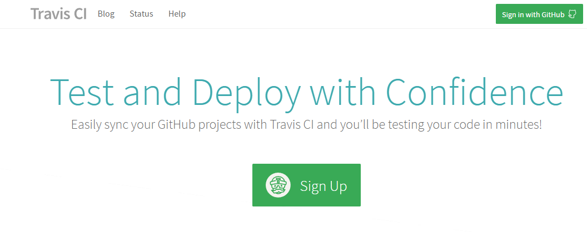
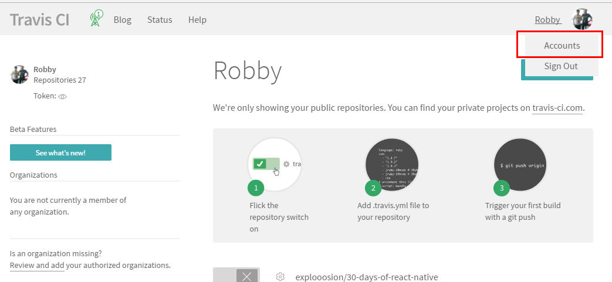
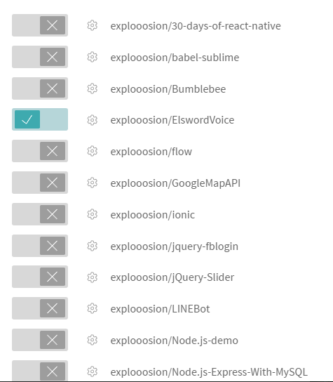
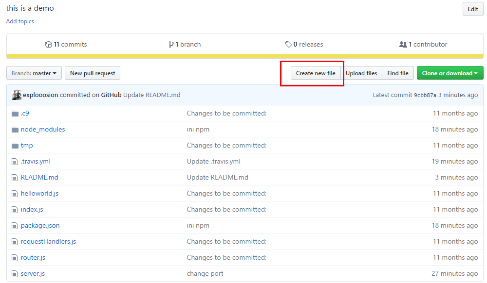
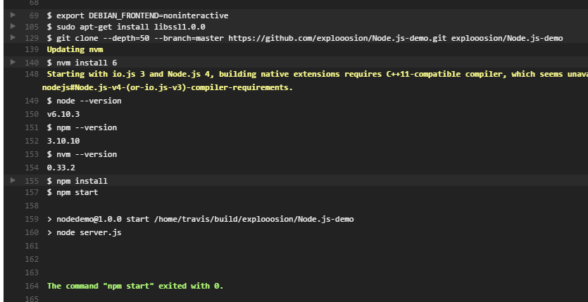
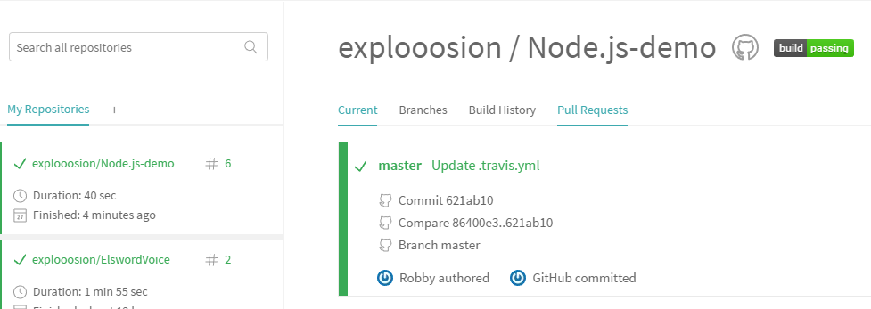
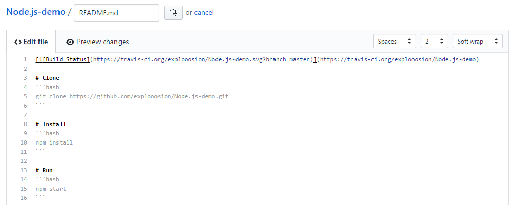
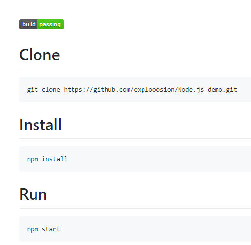

本篇標題與內文不符，小心服用！

一、廢話
----

如果有在使用 [Github](https://github.com) 的你，應該對下面這張圖非常熟悉吧！？

沒錯親愛的，這就是 [GMP食品認證](http://www.shs.edu.tw/works/essay/2008/03/2008032610505926.pdf)...

  
 

當然不是，但總會覺得好像擁有了他，

對於你的 Repository 會有種莫名的 Level Up，

你說是不是呢！！！

下圖就是超級認證 Super~~~~ OAO

[koajs/koa](https://github.com/koajs/koa)

二、真相
----

其實這是來自 [Travis CI](https://travis-ci.org/) 其中的測試功能，

Travis 提供了自動化部屬與測試功能，

即 [Test](https://en.wikipedia.org/wiki/Software_testing) & [Deploy](https://en.wikipedia.org/wiki/Software_deployment)

他能夠針對在 Github 上的專案進行同步的部屬與測試，

本篇只簡單描述如何快速建立該標誌，

當然應用相當廣泛，對於詳細應用可以參考 [Travis官方網站](https://travis-ci.org/)，

有興趣的人也可以參考 [Docker](https://www.docker.com/)。

三、實作
----

首先到 Travis 網站，並使用 Github 登入。

登入後於選單選擇 Account，進入後就可以看到你在 Github 上的 Repository。

同時也可以看到每個專案左側都有個開關鈕，能夠針對你想要加入 travis 的專案進行啟用。

開關給他按下去，然後點進去專案。

這時你會看到，畫面告訴你，尚未進行 build，

回到你的專案底下新增一個檔案「.travis.yml」　

內文要打什麼呢？

 travis 支援的語言相當多，只要你舉得起來，都可以幫你處理（？

本篇以 node.js 為例子，如果你使用的是不同語言，可以參考官方的文件 [Geting started](https://docs.travis-ci.com/user/getting-started/)。

    language: node_js
    node_js:
      - "6"
    notifications:
        email:
            recipients:
                - ta7382@gmail.com
            on_success: always
            on_failure: always
    install:
        - npm install
    script:
        - npm start

language：為宣告本專案主要佈署建置的語言

*   －6：並告知其版本
*   notification：當部屬成功或失敗的時候能夠透過指定的 email 進行發送通知
*   install：則為安裝的宣告，例如本範例需要透過 npm 進行 Package 的安裝
*   script：如果你的 package.json 有必須要執行的，則可於此增加。

信箱部分要小心使用...否則會爆炸

而上述步驟，就是針對你專案在本地執行時該做的事情是一樣的。

回到剛剛 travis 專案區，可以看見已經開始進行自動佈署了。

本專案主要是使用 node.js 進行網站架設，

而在終端機畫面上可以看到 Server has started on 8080 port... 

是很順利的完成架站了~

如果結果出現了失敗的標記，不妨去看看該對應的語言文件撰寫規格方式吧～

順利了話，就可以看到綠色的勝利標章囉～

標章是由 svg 繪製

首先點選上面的標章，選擇 Mardown（方便加入至 Github 的 Readme.md）。

把剛剛得到的路徑，貼回去 Readme.md 吧~

如此一來即使空蕩蕩的專案（Ｘ

也能夠感覺很專業呢！

當然其運用範圍相當廣泛，在剛剛 travis 部分，

如果仔細點點其他選單，會發現還有許多功能，

例如自動佈署，或排程等等，而成功失敗語法，

當然就會即時顯示在 Readme.md 畫面上囉 ~

四、後記
----

快來蒐集成為徽章大師吧

－

※. 關於 travis 還有很多功能，甚至資料庫的建置等等，透過終端機是可以做很多事情的

有勘誤之處，不吝指教。ob'\_'ov