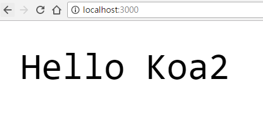
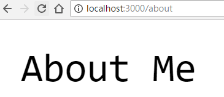
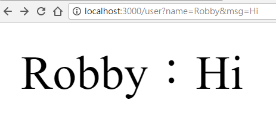
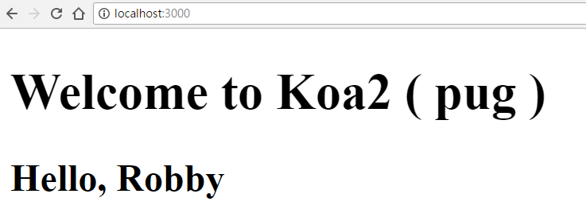
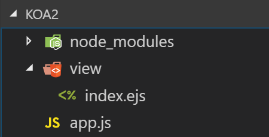
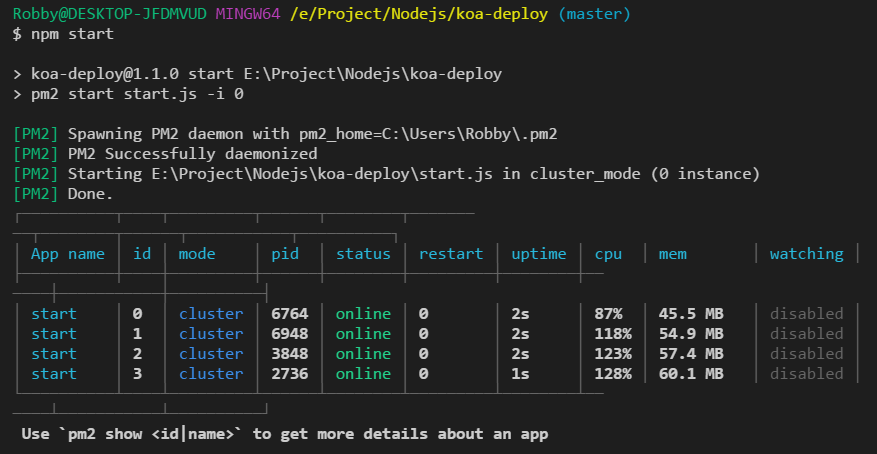

新手起家的 koa 2 框架分享。

重生吧！ Koa 2
----------

開始之前讓我們先聽聽一首歌曲...

_重生吧_、_前鬼_遵從我命、袪除邪惡，解除、解開束縛....

欸不對啦 ~

「重生」大概就是針對 koa 的總評語了！

一、前序
----

如果你是從 [express](http://expressjs.com/zh-tw/) 轉換過來的朋友，對於 [koa2](https://github.com/koajs/koa) 應該會很好上手，

koa2 的前身是 koa，但由於本人沒有特別接觸，所以不是很清楚。

_（聽說 koa第一版很亂就是了，有些奇怪的用法諸如 function \*()、yield）_

如果是第一次使用的朋友，個人是覺得可以先去看看 [express](https://github.com/expressjs/express)，

理解這類框架的特性後，再來使用 koa2 也不遲，

當然也可以直接從 koa2 著手也是沒問題的。

現在 JavaScript 已經發展到 [ES7](https://www.ecma-international.org/ecma-262/7.0/)，在此一版當中，最熱門的學習指標就是 Async、Await，

koa2 融入了此一應用，也成為 koa2 誘人的原因之一，

對於 ES6、ES7、koa2 想要更深入了解的朋友，可至本篇[**頁尾**](#相關文章)查看相關資源。

二、洋蔥式概念
-------

如上圖，koa2 核心可以想成一顆洋蔥。（圖源擷取至 [koa2源码分析](https://segmentfault.com/a/1190000008836418)）

從 request 到 response ，控制流程由數個 Middleware 處裡中間過程，

當然爾，Middleware 是由異步函數所建立的。

以另一張圖片來解釋涵式（[Koa 2.0 详解](http://n.thepana.com/2015/11/25/koa2-0/)）：

上圖中，由最外層的 CommonMiddleware  擔任第一道閘門，處理基本資訊，並且同時交給下一棒的 Session，

如此層地推進到底，就像[推進城](http://zh.onepiece.wikia.com/wiki/%E6%8E%A8%E9%80%B2%E5%9F%8E?variant=zh-tw)一樣，

當底層的相關作業 function 執行完後，直接返回，

以最內層方式一層一層脫離，如此一來實現了異步涵式的運行方式。

三、環境安裝
------

接下來就直接進入 koa2 的世界，讓我們開始安裝組合他吧！

如果使用過 express，會發現 koa 的環境是從零開始，必須是要自行打造的唷！

    npm install koa

*   如果未指定版本，目前會直接安裝 koa2，而不會安裝到 koa1

四、建立 Http Server
----------------

新增一個檔案 app.js。

    const Koa = require('koa');
    
    const app = new Koa();
    
    // 在此可塞入各種 Middleware
    // ...
    
    app.use(async function(ctx) {
        ctx.body = 'Hello Koa2';
    });
    
    app.listen(3000);

啟動伺服器，瀏覽網頁：[http://localhost:3000/](http://localhost:3000/)

    node app.js

就能夠簡單看到網頁已經建立起來，

而且 document 就是剛剛所指定的 Hello Koa2。

（下圖經過有經過放大處理）

五、**打造 Log Middleware**
-----------------------

如果我們想打造記錄「使用者請求的反應時間」，會在 request 以及 respone 時擷取資訊，

透過 await 即可輕易做到，以 ES7 所撰寫：

    app.use(async(ctx, next) => {
        const start = Date.now();
        await next();
        const ms = Date.now() - start;
        console.log(`${ctx.method} ${ctx.url} - ${ms}ms`);
    });

*   await next()：將跳至下一個階段，等待 Promise resolve。
*   ‵ ${ } ‵：在 console.log 當中，我們可以看到字串中又串接著變數，  
    　　　  透過  ‵ ${ } ‵，就可將變數包起來，此為 ES6 的特性之一，  
    　　　 即為「[模板字符串／Template literals](http://www.jianshu.com/p/8b263a6bde4d)」。

如果改回原本的 ES6，則寫法如下：

    app.use((ctx, next) => {
      const start = Date.now();
      return next().then(() => {
        const ms = Date.now() - start;
        console.log(`${ctx.method} ${ctx.url} - ${ms}ms`);
      });
    });

Middleware 其實就是由 Promise 所建立，

可以試著將滑鼠移到 next 查看（以 VScode 為例）。

再次啟動伺服器，試著重整網頁。

    node app.js

*   ctx.method：GET
*   ctx.url：/
*   ms：end - start

### koa-logger

[koa-logger](https://github.com/koajs/logger) 是官方所打造好的 Middleware，

了解原理後也可以直接使用現有的套件，安裝好即可使用。

    npm install koa-logger

    const logger = require('koa-logger');
    
    app.use(logger());

美美的 logger 也就會出現囉！

六、建立 Router
-----------

如果想要自行打造的朋友，透過原生 koa 的方式處理，

可以參考：[koa2 原生路由实现](https://chenshenhai.github.io/koa2-note/note/route/simple.html)

以下我們使用官方所提供的 [koa-router](https://github.com/alexmingoia/koa-router)，來進行路由製作。

安裝

    npm install koa-router

自訂路由

    const Koa = require('koa');
    const Router = require('koa-router');
    const app = new Koa();
    
    const router = Router();
    
    // Router -> /
    router.get('/', async(ctx) => {
        ctx.body = 'Hello World';
    });
    
    // Router -> /about
    router.get('/about', async(ctx) => {
        ctx.body = 'About Me';
    });
    
    app.use(router.routes());
    
    app.listen(3000);

修改網址到 [http://localhost:3000/about](http://localhost:3000/about)，就可以看到 About Me。

七、GET－接收 QueryString 參數
-----------------------

如果要解析網址列上的參數，也是十分簡單的，

例如有個路由是 /user：

    router.get('/user', async(ctx) => {
    
        let name = ctx.query.name;
        let msg = ctx.query.msg;
        ctx.body = `
${name}：${msg}
`;
    });

*   ctx.query.\[params\]：即可取到網址列相關參數

執行伺服器

    node app.js

看看網頁是否也跟我一樣呢？

[http://localhost:3000/user?name=Robby&msg=Hi](http://localhost:3000/user?name=Robby&msg=Hi)

八、POST－接收 body 資料
-----------------

如果想要解析來自網頁表單 form 所送出的資料，必須安裝第三方套件，

[koa-bodyparser](https://github.com/koajs/bodyparser) 為官方提供解析 body request 的內容，透過掛載 Middleware 即可使用囉。

安裝

    npm install koa-bodyparser

套用

    const bodyParser = require('koa-bodyparser');
    
    app.use(bodyParser());

建立一個提供表單送出的頁面（GET）

    router.get('/login', async(ctx) => {
        ctx.body = `
        <form method="POST" action="/login">
            <label>UserName</label>
            <input name="usr" /> 
            <button type="submit">submit</button>
          </form>
        `;
    });

*   後續會提到如何使用靜待檔案 index.html，或是樣板引擎（ejs、pug）等等。

由 login 表單發送 POST，解析得到的 body 並顯示：

    router.post('/login', async(ctx) => {
        let usr = ctx.request.body.usr;
        ctx.body = `
Welocome,${usr}!
`;
    });

試試看填寫表單吧 ~

[http://localhost:3000/login](http://localhost:3000/login)

發送表單，畫面就會顯示剛剛的姓名囉！

九、載入靜態 HTML
-----------

上述的範例中，html DOM 內容都是用字串組成，如果我們今天想要載入指定的 html，

只要取檔案的絕對路徑位置，並透過 nodejs 的 readFileSync 讀取，就可以取得內容了。

引用 fs、path。

    const fs = require('fs');
    const path = require('path');

利用 path.join 方式取得檔案絕對路徑，並透過 fs.readFileSync 取得檔案二進位內容。

    function render(filename) {
    
        let fullpath = path.join(__dirname, filename);
        return fs.readFileSync(fullpath, 'binary');
        
    }

在 router 部分 call render()，並指定給 ctx.body，就能夠順利取得囉。 

    // Router -> /
    router.get('/', async(ctx) => {
        ctx.body = render('index.html');
    });

當在根目錄 / 的時候會載入 index.html。

    <!DOCTYPE html>
    <html lang="en">
    
    <head>
        <title></title>
        <meta charset="UTF-8">
        <meta name="viewport" content="width=device-width, initial-scale=1">
    </head>
    
    <body>
        <h1>Hello, here is index.html</h1>
    </body>
    
    </html>

實際看看結果：

[http://localhost:3000/](http://localhost:3000/)

    node app.js

### koa-views

當然我們也不需要大費周章的刻，

可以使用官方現有的套件 [koa-views](https://github.com/queckezz/koa-views)，

目前從 npm 安裝的 koa-views 主要支援 koa2 為主。

    npm install koa-views

引用 koa-views 。

    const views = require('koa-views');

掛載到 app 上。

    app.use(views(__dirname, {
        extension: 'html'
    }));

*   \_dirname：目前專案路徑絕對位置
*   extension：要載入的副檔名

完成掛載後，我們直接在 router 上指定：

    // Router -> /
    router.get('/', async(ctx) => {
        await ctx.render('index')
    });

*   await：由於載入需要時間讀取，因此我們使用 await 等待載入結束。

如果不使用 await，則會發現讀取不到檔案，然後爆掉了 QQ

切回去觀察 log，可以發現 handler 噴出錯誤訊息：

promise rejection，

error：Can't set headers after they are set

因為當 promise 執行結束正準備寫入 response 時，早就已經將結果 render 給使用者了，

但因為 response 沒有內容也找不到來源路徑，因此就 404 Not Found 囉！

十、模板引擎 （[pug](#pug)、[ejs](#ejs)）
--------------------------------

通常在開發上，除非僅是小型網站、個人測試，才會直接使用 html，

因此通常前端有兩種方式渲染 DOM：

1.  使用模板引擎（[JavaScript Template](https://colorlib.com/wp/top-templating-engines-for-javascript/)）
2.  使用前端框架（[Front-end Framework](https://github.com/showcases/front-end-javascript-frameworks)）

本篇僅針對簡單的模板引擎（pug、ejs）分享。

### [Pug](https://pugjs.org)

pug 先前名稱為 jade，由於名字被註冊了以及一些[八卦](https://www.zhihu.com/question/46418330)，因此改為 pug，

不過也獲得可愛的 logo，汪！

安裝 pug（[Github](https://github.com/pugjs)）套件。

    npm install pug

不需要 require 引用，直接修改剛剛 views 即可。

    app.use(views(__dirname + '/view', {
        extension: 'pug'
    }));

*   \_\_dirname + '/view'：樣板統一在 view 資料夾底下
*   extension：pug 副檔名皆為此

修改路由內容，除了載入 index.pug 外，也回傳指定參數 title、name、engine，

這些變數單純隨意命名，深入應用可以為 [session](https://github.com/Secbone/koa-session2) 等使用。

    // Router -> /
    router.get('/', async(ctx) => {
        await ctx.render('index', {
            title: 'Koa2',
            name: 'Robby',
            engine: 'pug'
        })
    });

資料夾結構：

pug 的 html 樣版設計僅靠縮排，這點須注意，在取資料的部分則使用 #{ }，詳細使用方法可查看[官方文件](https://pugjs.org/api/getting-started.html)

    doctype html
    html
      head
        title koa2
    
      body
        h1 Welcome to #{title} ( #{engine} )
        h2 Hello, #{name}

啟動伺服器執行看看唄！

[http://localhost:3000/](http://localhost:3000/)

－

### [EJS](http://www.embeddedjs.com/)

安裝 ejs（[Github](https://github.com/tj/ejs)）套件。

    npm install ejs

一樣不需要 require ，直接更改 filter ，指定附檔名為 ejs。

    app.use(views(__dirname + '/view', {
        extension: 'ejs'
    }));

*   \_\_dirname + '/view'：樣板統一在 view 資料夾底下
*   extension：ejs 副檔名皆為此

這邊僅修改 engine，讓大家容易辨別。

    // Router -> /
    router.get('/', async(ctx) => {
        await ctx.render('index', {
            title: 'Koa2',
            name: 'Robby',
            engine: 'ejs'
        })
    });

資料夾結構

ejs 的使用皆透過 <% %> 包覆資料，詳細使用方法可查看[官方文件](http://www.embeddedjs.com/getting_started.html)

    <!DOCTYPE html>
    <html lang="en">
    
    <head>
        <title></title>
        <meta charset="UTF-8">
        <meta name="viewport" content="width=device-width, initial-scale=1">
    </head>
    
    <body>
        <h1>Welcome to <%=title%> ( <%=engine%> )</h1>
        <h2>Hello, <%=name%></h2>
    </body>
    
    </html>

啟動執行看看

[http://localhost:3000/](http://localhost:3000/)

  
 

※、koa-deploy（自製分享）
------------------

小弟有針對 koa2 常用的組件進行整理，寫成一個預設好環境的框架 [koa-deploy](https://github.com/explooosion/koa-deploy)，

可以參考看看，如果覺得還不錯，不妨給予支持小星星吧～

下載、安裝

    git clone https://github.com/explooosion/koa-deploy.git

    cd koa2-deploy
    npm install

執行方式本人使用 [nodemon](https://github.com/remy/nodemon)、[pm2](https://github.com/Unitech/pm2)，

此兩樣為強大的 node 伺服器管理，前者較適合開發上使用，後者為發佈上站用。

#### 使用 [nodemon](https://github.com/remy/nodemon)

    npm install -g nodemon

    npm run dev

*   停止則直接使用 Ctrl + C

### 使用 [pm2](https://github.com/Unitech/pm2)

    npm install -g pm2

    npm start

    npm stop

如果啟動後發生 cmd 小視窗不斷地跳出又關閉，

那就是你的 **port** 被占用了，試試手速下 **npm stop** 關閉看看吧！

（否則只能電腦登出了　ＸＤ　哈哈，這是 pm2 上的小問題）

以上為針對 koa2 上的分享。

※、相關參考
------

如果對於 ES6 仍不熟悉者，建議可以看看：

*   [從ES6開始的JavaScript學習生活](https://www.gitbook.com/book/eyesofkids/javascript-start-from-es6/details)
*   [ECMAScript 6 入门](http://es6.ruanyifeng.com/)

如果不熟悉 ES7，建議可以看看相關文章：

*   [\[Javascript\] ES7 Async Await 聖經](https://medium.com/@peterchang_82818/javascript-es7-async-await-%E6%95%99%E5%AD%B8-703473854f29-tutorial-example-703473854f29)

 koa2 gitbook：

*   [《koa2进阶学习笔记》](https://chenshenhai.github.io/koa2-note/)

本篇內容來自各篇文章彙整：

*   [Github - Koa](https://github.com/koajs/koa)
*   [Fred's blog - Koa 2 起手式！](http://fred-zone.blogspot.tw/2017/02/koa-2.html)
*   [Koa 2.0 详解](http://n.thepana.com/2015/11/25/koa2-0/)
*   [Koa 2实用入门](https://cnodejs.org/topic/5709959abc564eaf3c6a48c8)
*   [「新手向」koa2从起步到填坑](http://www.jianshu.com/p/6b816c609669)

有勘誤之處，不吝指教。ob'\_'ov