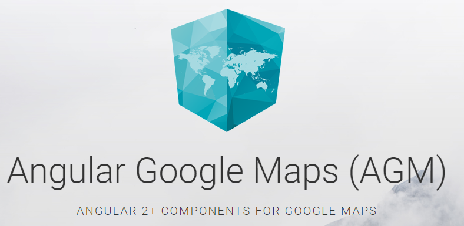
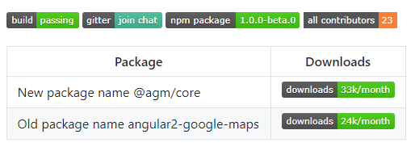
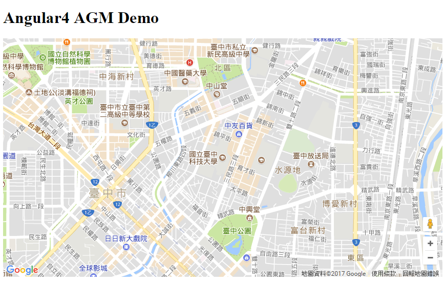
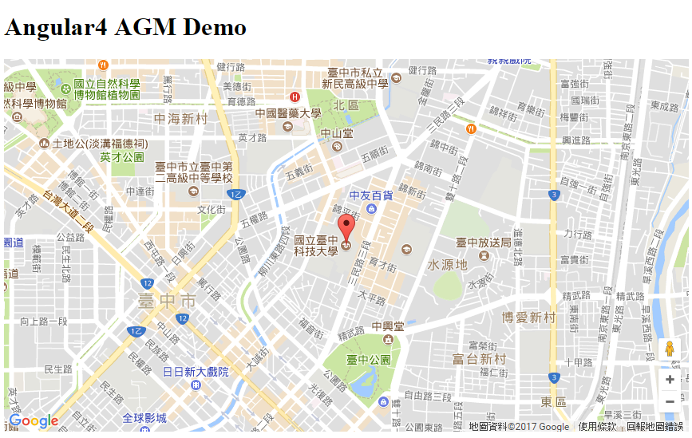
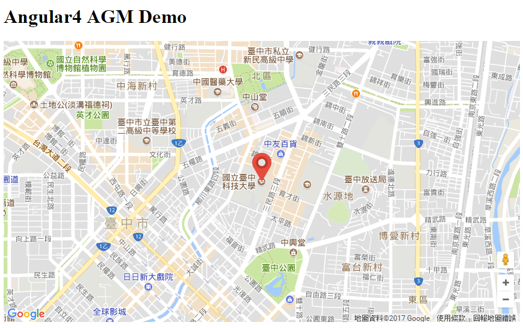
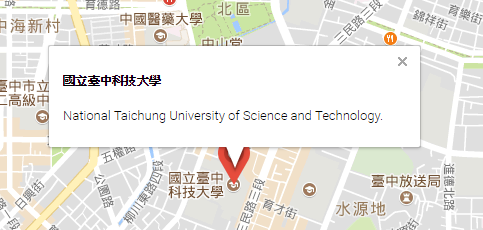
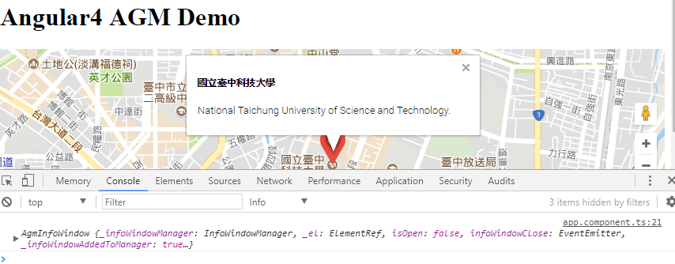
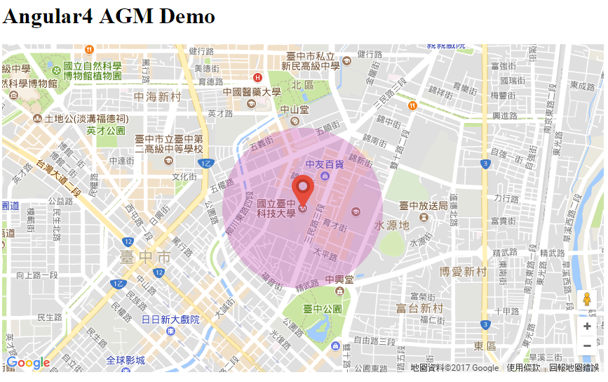
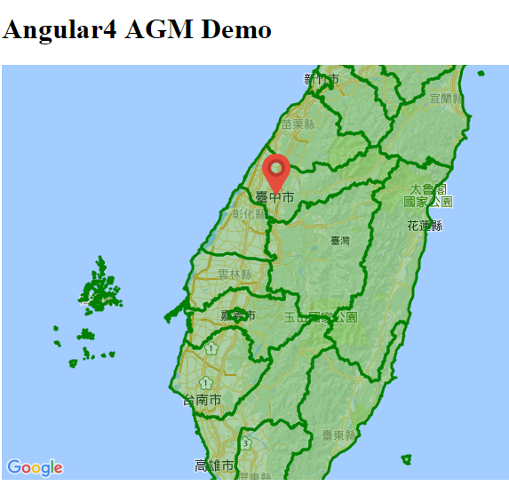

利用套件 angular-google-maps（AGM）快速上手 google map

在 [Angular](https://angular.io/) 框架中，如果要使用 Google Map API，

但因為 TypeScript 的要求，較不好利用資料綁定（DataBinding）配合原生JS操作地圖。

目前在 Angular2+（2~4） 框架上，國外團隊已製作出相關套件，

自己先前也因專案的需求研究使用了不少，

本篇介紹 [AGM](https://github.com/SebastianM/angular-google-maps) ，將使用心得分享給大家。

*   Github： [angular-google-maps（AGM）](https://github.com/SebastianM/angular-google-maps) 
*   Web：[Angular Google Maps (AGM)](https://angular-maps.com/)
*   Doc：[API Docs for Angular Google Maps](https://angular-maps.com/api-docs/agm-core/modules/AgmCoreModule.html)

一、Install
---------

如下圖，可看到官方目前有新舊版本之分，

雖然使用方式皆相同，但命名的不同容易讓人混淆，

目前的相關文件也仍是舊版，因此本篇將以新版（@agm/core）的方式介紹。

首先進行安裝，目前版本為 1.0.0 beta版。

    npm install @agm/core --save

到 src/app/app.module.ts  中引入 AGM 模組。

    import { AgmCoreModule } from '@agm/core';

在 @NgModule 中，imports 加入 AgmCoreModule，

金鑰部分則須到 [Google Map API](https://console.developers.google.com/apis/dashboard) 申請。

若為測試其實可留白（移除 YOUR\_KEY，改為空字串），只是容易受 Request 次數限制使用。

［app.module.ts］

    @NgModule({
      imports: [
        BrowserModule,
        CommonModule,
        FormsModule,
        AgmCoreModule.forRoot({
          apiKey: 'YOUR_KEY',
          language: 'zh-TW'
        })
      ],
      providers: [],
      declarations: [ AppComponent ],
      bootstrap: [ AppComponent ]
    })
    export class AppModule {}

*   language：在此填入 zh-TW，其實也可以將此屬性省略。
*   apiKey：google map api key

二、Component－Map
---------------

在 app 組件中，我們加入以下變數。

［app.component.ts］

    import { Component } from '@angular/core';
    
    @Component({
      selector: 'app-root',
      templateUrl: './app.component.html',
      styleUrls: ['./app.component.css']
    })
    export class AppComponent {
      title: string = 'Angular4 AGM Demo';
      lat: number = 24.1504536;
      lng: number = 120.68325279999999;
      zoomValue: number = 15;
    }

*   lat：緯度（number 數字型別）
*   lng：經度（number 數字型別）
*   zoomValue：視圖倍率
*   備註：設定上習慣會先設定緯度再來是經度

在 html 中加入 agm-map 標籤，並提供預設定位點 ［latitude］、［longitude］。

如果沒有設定預設定位點，會被定位在海上哦！！　ＸＤ

［app.component.html］

    <agm-map [latitude]="lat" [longitude]="lng" [zoom]="zoomValue">
    </agm-map>

*   agm-map  API：[AgmMap](https://angular-maps.com/api-docs/agm-core/components/AgmMap.html)

這時候到網頁看看.....疑疑疑！？！？

別急～你會發現空空如也！別忘了設定地圖高度。

［app.component.css］

    agm-map {
        height: 80vh;
    }

Demo

三、Component - Marker
--------------------

利用 agm-marker，就可以指定地點標記，

我們用開始設定好的經緯度，直接指定目標點位。

［app.component.html］

    <agm-map [latitude]="lat" [longitude]="lng" [zoom]="zoomValue">
      <agm-marker [latitude]="lat" [longitude]="lng" [iconUrl]="iconUrl"></agm-marker>
    </agm-map>

*    agm-marker API：[AgmMarker](https://angular-maps.com/api-docs/agm-core/directives/AgmMarker.html)
*   iconUrl：標記點的圖片，若無設定，則預設（我們平常看到的那種）

［app.component.ts］

    export class AppComponent {
      title: string = 'Angular4 AGM Demo';
      lat: number = 24.1504536;
      lng: number = 120.68325279999999;
      zoomValue: number = 15;
      iconUrl: string = 'http://i.imgur.com/0TctIfY.png';
    }

Demo（無自訂圖案）：

Demo（自訂圖案）：

四、Component - Marker + InfoWindow
---------------------------------

如果想要設計一個點選 marker 時，會彈出訊息小窗，

可以利用 InfoWindow，此功能原 google map api 就有。

我們建立一個 markerClick Event，並且新增一個 infowindow：

［app.component.html］

    <agm-map [latitude]="lat" [longitude]="lng" [zoom]="zoomValue">
      <agm-marker [latitude]="lat" [longitude]="lng" [iconUrl]="iconUrl" (markerClick)="markerClick()"></agm-marker>
      <agm-info-window [latitude]="lat+0.0005" [longitude]="lng" [isOpen]="isOpen">
        <h5>國立臺中科技大學</h5>
        
National Taichung University of Science and Technology.

      </agm-info-window>
    </agm-map>

*   agm-info-window API：[AgmInfoWindow](https://angular-maps.com/api-docs/agm-core/components/AgmInfoWindow.html)
*   infowindow：在屬性上故意利用 lat+0.0005，因為我們希望訊息顯示在點位偏上，否則會導致重疊不清楚。
*   isOpen：是否顯示。
*   markerClick()：事件名稱可自訂，當 click 事件觸發時的 funtion

當事件觸發時，我們將 isOpen 改為 true 即可。

［app.component.ts］

      isOpen: boolean = false;
    
      public markerClick(e) {
        this.isOpen = true;
      }

不過當我們關閉後，會發現卻再也無法點選回去了，

其實是因為這裡的關閉按鈕（x）有點像 ngIf，它會讓這個 Object 移除。

所以我們修改一下程式碼，在 agm-info-window 上增加該識別標籤 #infowindow，

並且將此識別標籤傳入給 click 事件，如此一來即可控制該物件。

［app.component.html］

    <agm-map [latitude]="lat" [longitude]="lng" [zoom]="zoomValue">
      <agm-marker [latitude]="lat" [longitude]="lng" [iconUrl]="iconUrl" (markerClick)="markerClick(infowindow)"></agm-marker>
      <agm-info-window #infowindow [latitude]="lat+0.0005" [longitude]="lng" [isOpen]="isOpen">
        <h5>國立臺中科技大學</h5>
        
National Taichung University of Science and Technology.

      </agm-info-window>
    </agm-map>

修改一下 click 事件，利用 InfoWindow API 中的 open() 方法打開他。

［app.component.ts］

      public markerClick(e) {
        console.log(e);
        e.open();
        this.isOpen = true;
      }

打開瀏覽器開發者模式，透過 console.log 就可看到物件資訊

五、Component - Circle
--------------------

如果我們想利用 google map api 中的 circle 方法，

繪製出一個區域範圍的圓形，使用 agm-circle 即可繪製。

加入 agm-circle 標籤，給予經緯度，並指定半徑即可。

［app.component.html］

    <agm-map [latitude]="lat" [longitude]="lng" [zoom]="zoomValue">
      <agm-circle [latitude]="lat" [longitude]="lng" [radius]="radius" [fillColor]="fillColor"></agm-circle>
      <agm-marker [latitude]="lat" [longitude]="lng" [iconUrl]="iconUrl" (markerClick)="markerClick(infowindow)"></agm-marker>
      <agm-info-window #infowindow [latitude]="lat+0.0005" [longitude]="lng" [isOpen]="isOpen">
        <h5>國立臺中科技大學</h5>
        
National Taichung University of Science and Technology.

      </agm-info-window>
    </agm-map>

*   agm-circle API：[AgmCircle](https://angular-maps.com/api-docs/agm-core/directives/AgmCircle.html)
*   radius：圓形半徑（公尺）
*   fillColor：塗滿顏色（預設黑色），該屬性自動包含透明  
    　　　　 顏色可用：  
    　　　　　　　HTML－#C23CAC  
    　　　　　　　RGBA－rgba(194,60,172,1)

［app.component.ts］

      radius: number = 500;
      fillColor: string = 'rgba(194,60,172,1)';

*   radius：其實就是500公尺唷！
*   fillColor：給個粉紅色好了～

Demo：

六、Component  - DataLayer
------------------------

如果我們想要介接圖資，可利用 agm-data-layer，讀取圖資。

為了測試使用，我們可以利用 OpenData 中的 [直轄市、縣市界線(TWD97經緯度)](http://data.gov.tw/node/7442)，

由於提供的檔案是 Shp（[shapefile](https://zh.wikipedia.org/zh-tw/Shapefile)），我們要轉成 JSON 格式才可讀取。

  
個人先前有碰過這類需求問題，也順手記錄成文章，

關於轉換的方法可參考此篇 - [mapshaper - Shp to topojson](https://dotblogs.com.tw/explooosion/2017/06/04/020426)。

_覺得還蠻幸運的，還好有紀錄，否則就要在這採坑一段時間了ＱＱ_

在 AGM 中，我們要將圖資轉為 [geojson](http://geojson.org/)：

    npm install -g mapshaper
    mapshaper county.shp -o encoding=big5 format=geojson  county.json

首先我們先建立一個 Service，程式碼才不會雜亂，

而該服務會讀取JSON，並回傳解析後程式：

    ng g service service/layer

為了使用 Http 以及 Json 模組，我們必須先注入相關 Provider，

在上方 import Http 以及 Json 模組，並且加入於下方 imports。

［app.module.ts］

    
    import { HttpModule, JsonpModule } from '@angular/http';
    
      imports: [
        HttpModule,
        JsonpModule,
        ...
    
    

完成後開始撰寫 layerService，

一開始我們先引入 Http、Response 模組，

並且也引入 rxjs 中的 map 模組，提供我們解析資料。

［layer.service.ts］

    import { Injectable } from '@angular/core';
    import { Http, Response } from '@angular/http';
    
    import 'rxjs/add/operator/map';

注入 http 模組，並設定檔案路徑。

讀取的檔案路徑不是 layer.service.ts 的相對路徑哦！

［layer.service.ts］ 

    public url: string = 'assets/county.json'
    
    constructor(private http: Http) { }

建立一個讀取資料的方法。

［layer.service.ts］

    public getGeoJsonLayer() {
        return this.http.get(this.url)
          .map((res) => {
            return res.json() || {}
        });
    }

*   map：為 rx.js 中的方法之一
*   res.json：回傳 JSON 格式
*   url： http://localhost:4200 的相對路徑
*   assets：此為 Angular 預設的靜態位置

回到 app.component.ts 中，引入 OnInit，讓畫面載入時呼叫，

也引入我們剛剛寫好的 LayerService。

［app.component.ts］

    import { Component, OnInit } from '@angular/core';
    
    import { LayerService } from './service/layer.service';

注入 LayerService 服務：

［app.component.ts］

    @Component({
      ...
      providers: [LayerService]
    })

在最上方我們讓 AppComponent 使用 [Lifecycle hooks](http://ithelp.ithome.com.tw/articles/10188047) 中的 OnInit 。

*   implements OnInit

［app.component.ts］

    export class AppComponent implements OnInit {
      ...[省略]
    }

在建構式中，宣告 layerService，同時建立一個 Object 存放資料。

利用 rx.js 方式 [subscribe](http://ithelp.ithome.com.tw/articles/10187601) 內容，並將結果指定給 geoJson 變數。 

［app.component.ts］

      geoJson: Object = null;
    
      constructor(private layerService: LayerService) { }
    
      ngOnInit() {
        this.layerService.getGeoJsonLayer()
          .subscribe(
          result => {
            this.geoJson = result;
          });
      }

最最最最後！我們只要加入 agm-data-layer 就完成惹！

    <agm-map [latitude]="lat" [longitude]="lng" [zoom]="zoomValue">
      <agm-data-layer [geoJson]="geoJson"></agm-data-layer>
      <agm-circle [latitude]="lat" [longitude]="lng" [radius]="radius" [fillColor]="fillColor"></agm-circle>
      <agm-marker [latitude]="lat" [longitude]="lng" [iconUrl]="iconUrl" (markerClick)="markerClick(infowindow)"></agm-marker>
      <agm-info-window #infowindow [latitude]="lat+0.0005" [longitude]="lng" [isOpen]="isOpen">
        <h5>國立臺中科技大學</h5>
        
National Taichung University of Science and Technology.

      </agm-info-window>
    </agm-map>

*   agm-data-layer API：[AgmDataLayer](https://angular-maps.com/api-docs/agm-core/directives/AgmDataLayer.html)
*   geoJson：圖資須為 GeoJson 格式

Demo：

七、Component  - DataLayer Style
------------------------------

為什麼 datalayer 的 style 要挪出一個章節講呢？

因為這 **坑** 踩了很久啊啊啊啊啊啊 ＱＱ，只能說當時搞很久，

#### _**整夜輾轉難以入眠！！！！！！！！！**_

希望給還沒開始的朋友一點建議。

看了官方的 [API](https://angular-maps.com/api-docs/agm-core/directives/AgmDataLayer.html) 說明：

因此照著設定

［app.component.html］

    <agm-data-layer [geoJson]="geoJson" [style]="style"></agm-data-layer>

［app.component.ts］ 

      public style() {
        return {
          fillColor: 'green',
          strokeColor: 'green',
        };
      }

始終是無效的，為什麼會這樣呢？

因為你的資料 geoJson 還沒讀取完畢的時候［style］已經先跑了，

根本沒得設定，因為 geoJson 是 null，因此我們只是去設定一個 null 的集合 QQ。

個人查了相關 ISSUE，綜合測試出兩種解法 （崩潰中），分享給大家！

### 解法一：

利用 \*ngIf 方式，當讀取完畢後，再讓 geoJsonReady = true。

［app.component.html］

    <agm-data-layer *ngIf="geoJsonReady" [geoJson]="geoJson" [style]="style"></agm-data-layer>

［app.component.ts］

      ngOnInit() {
        this.layerService.getGeoJsonLayer()
          .subscribe(
          result => {
            this.geoJson = result;
            this.geoJsonReady = true;
          });
      }

### 解法二：

此解法雖然修改幅度多，但使用的理念彈性較大，

利用動態方式產生 agm-data-layer。 

［app.component.html］

    <agm-map [latitude]="lat" [longitude]="lng" [zoom]="zoomValue" (mapReady)="onReady($event)">

*   mapReady：地圖載入完畢時執行的方法

  
［app.component.ts］

      map: any = null;

把傳入的 map 指定給 this.map ，

並透過 [addGeoJson](https://developers.google.com/maps/documentation/javascript/datalayer?hl=zh-tw) 方法，加入圖層資料（此為操作原 Google Map API 的方法）

同時在 setStyle 的部分讓他去跑我們一開始設定好的 stlye()。 

［app.component.ts］

      onReady(map) {
        this.map = map;
      }
    
      ngOnInit() {
        console.log('Start: ' + new Date());
        this.layerService.getGeoJsonLayer()
          .subscribe(
          result => {
            this.geoJson = result;
            this.map.data.addGeoJson(this.geoJson);
            this.map.data.setStyle(feature => this.style());
          });
      }

兩者效能上沒有什麼差異，誤差值１秒內。

因此各位可根據不同的需求使用不同的方法囉！

Demo：

八、後記
----

本篇 AGM 的使用經驗是在［[2017 7/16 <嘉義黑蚵松>](http://www.accupass.com/go/hackforlocal)］所碰到，

連續踢到鐵板哀哀叫啊啊啊啊 ＱＱ

專案：**[ChiayiHackathon](https://github.com/explooosion/ChiayiHackathon)（[Demo](https://chiayi-ht.robby570.tw/)）** _覺得不錯可以給個星星呀 XD 趁機宣傳_

為了不讓有需求的入門使用者，步上小弟的後路，決定寫下使用經驗。

本篇專案範例皆提供在 Github 上，

如果有幫助到各位，不妨給個**星星**（也許可以知道又少了一位受害者惹 ＱＱ）

如果您有更好的解法或是相關使用，也歡迎留言分享～

（當載入[村里界圖](http://data.gov.tw/node/7438)就會踢到效能問題... 77.6MB）。

本專案 Github - **[Angular-AGM](https://github.com/explooosion/Angular-AGM)**

下載

    git clone https://github.com/explooosion/Angular-AGM.git

安裝

    cd an-agm
    npm install

視環境可能會安裝到

    npm install -g @angular/cli

啟動

    ng serve

感謝閱讀，獻給對於 angular gmap 需求者。

有勘誤之處，不吝指教。ob'\_'ov