記錄著從 Vue 新手村出發的練功歷程...

本篇任務指引：
-------

1.  了解何謂資料綁定
2.  認識單向與雙向差異
3.  綁定網頁元素

**一、什麼是資料綁定**
-------------

資料綁定可以稱「Data Flow」或「Data Binding」，

意思可以解釋成網頁上的資料是透過特定的流程方式控制。

如果你接觸過其他框架，應該對這名詞很熟悉，

目前的各大前端框架都有使用到此一行為。

哩咧工三小！？

QQ 換個更簡單的說法：

「我們給什麼資料他就呈現什麼。」[_// 請小心GIGO_](https://zh.wikipedia.org/zh-tw/%E5%9E%83%E5%9C%BE%E8%BF%9B%EF%BC%8C%E5%9E%83%E5%9C%BE%E5%87%BA)

比如以下熟悉的範例：

    <body>
    
        

            {{ msg }}
        

        
    </body>

我們可以知道，id 為 hello 的內容是由變數「msg」所表示，

因此可以說 id 為 hello 的內容是由 msg 所綁定，

而實際的值就是 'Hello World !'。

**二、單向與雙向綁定**
-------------

在資料綁定上還有細分兩種：

*   單向綁定（one-way）：只能單方面接受內容，給你什麼就顯示什麼。
*   雙向綁定（two-way）：可以互相控制內容，只要更動過資料，另一方會同步更動。

因此在剛剛範例中，其實就是典型的單向綁定，msg 設定什麼就出現什麼內容。

在雙向的綁定使用方法，會使用到 Model，

他是用來分析元件之間的互動，也可以想成是存放當前狀態，

下圖是官方針對資料綁定的示意圖：

上圖的 View 為我們網頁畫面，DOM Listeners 為事件的監聽，

例如當文字方塊輸入的時候觸發，那就會觸發 event，

傳給 Model 後會進行分析，以確保資料的最新狀態，

最後再透過  Data Binding 給 View。

**三、表單的資料綁定**
-------------

接下來讓我們實際來寫寫看吧！

網頁表單的元件有很多種，以下簡單介紹常用的幾項：

1.  [input - text](#input-text)
2.  [input - checkbox](#input-checkbox)
3.  [input - checkbox（集合）](#input-checkbox-group)
4.  [input - radio](#input-radio)
5.  [select](#select)

### **［input - text］**

文字方塊的使用可以是雙向綁定，因為他本來就是提供給人輸入用的呀～

好 ... 冷靜！

如果要進行雙向綁定，請使用「v-model」。

    <h1>VueJS - Form</h1>
    
    

       Message is: {{ message }}
        
       <input type="text" v-model="message" placeholder="edit me">
    

    
    

上方程式碼我們可以得知：

1.   的內容是單向綁定
2.  <input> 的內容是雙向綁定

實際畫面：

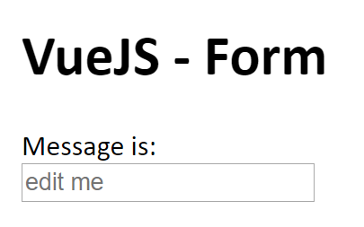  
 

任意輸入內容：

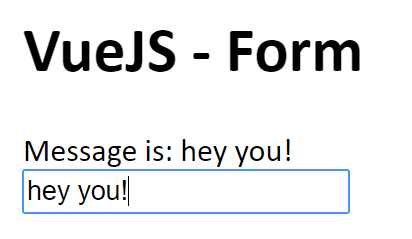

### **［input - checkbox］**

再來是設計一個能夠勾選的文字方塊，只要跟值有關的我們都使用 v-model 表示。

    <h1>VueJS - Form</h1>
    
    

        <input type="checkbox" id="checkbox" v-model="checked">
        <label for="checkbox">{{ checked }}</label>
    

    
    

在原本標準 html 中，checkbox 原本的寫法：

    <input type="checkbox" value="car" checked>

*   checked ：表示已勾選的狀態

是否勾選 checked 其實就是一個[布林值](https://zh.wikipedia.org/wiki/%E5%B8%83%E7%88%BE_(%E6%95%B8%E6%93%9A%E9%A1%9E%E5%9E%8B))所決定，

因此在 data 的部分我們直接設定 bool 型別即可。

實際畫面：

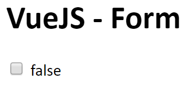

勾選看看：

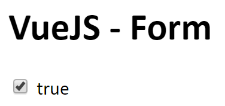

### **［input - checkbox （集合）］**

那麼一群 checkbox 該怎麼設定呢？

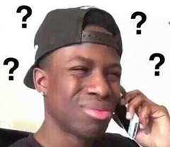

首先我們建立一群核取方塊，每個都有自己的 value 值，

由於是集合，且是可複選的，因此代表值不只一個，

所以我們 checkedFruit 會以陣列型別儲存，並且一開始給他空陣列，

當我們勾選的時候，會自動將值 [push](http://www.w3school.com.cn/jsref/jsref_push.asp) 進去。

    <h1>VueJS - Form</h1>
    
    

        <input type="checkbox" id="apple" value="apple" v-model="checkedFruit"><label for="apple">apple</label>
        <input type="checkbox" id="orange" value="orange" v-model="checkedFruit"><label for="orange">orange</label>
        <input type="checkbox" id="banana" value="banana" v-model="checkedFruit"><label for="banana">banana</label>
         CheckedFruit：{{ checkedFruit }}
    

    
    

實際畫面：

勾選時：

為何上述要說這是一個 push 的動作？

我們試著先勾選 banana 再勾選 apple 看看結果：

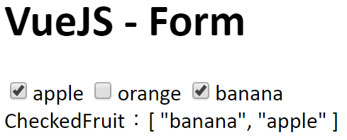

是的親愛的，後來勾選的 apple 跑到後面去了，

因為 push 是典型的「[堆疊](https://zh.wikipedia.org/wiki/%E5%A0%86%E6%A0%88)」結構。

[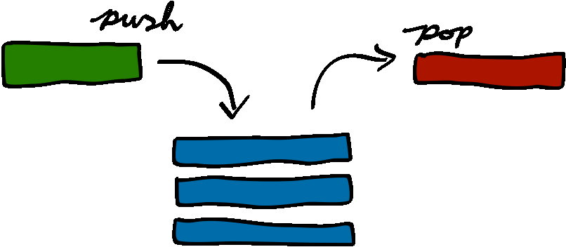](https://dotblogsfile.blob.core.windows.net/user/incredible/9e949fb6-dd7c-49e8-9e2d-a50f8859d1a5/1501336872_27752.jpg)

*   圖片來源：[用 JavaScript 學習資料結構和演算法：堆疊（Stack）篇](http://blog.kdchang.cc/2016/06/24/javascript-data-structure-algorithm-stack/)

雖然內容結果都相同，但請務必記得順序是不同的唷！

### **［input - radio］**

表單功能中在單選（radio）的部分跟 checkbox 很像，

一樣有 value，並且是否勾選由 v-model 所綁定，

至於 picked 的內容不再是陣列，因為只能單選。

    <h1>VueJS - Form</h1>
    
    

        <input type="radio" id="one" value="one" v-model="picked"><label for="one">One</label>
        <input type="radio" id="two" value="two" v-model="picked"><label for="two">Two</label>
         Picked: {{ picked }}
    

    
    

實際畫面：

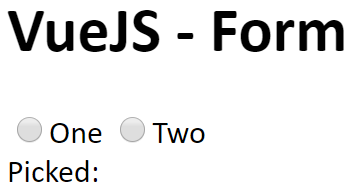

任意勾選其一：

### **［select］**

在下拉式清單中，我們會把 v-model 寫在 select 上，

勾選的內容直接寫在 <option> 裡面即可，預設這邊給他選擇 'B'：

    <h1>VueJS - Form</h1>
    
    

        <select v-model="selected">
            <option>A</option>
            <option>B</option>
            <option>C</option>
        </select>
        Selected: {{ selected }}
    

    
    

實際畫面：

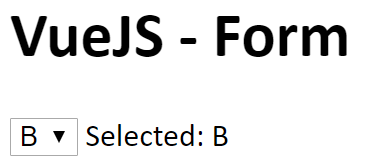

選擇別的選項：

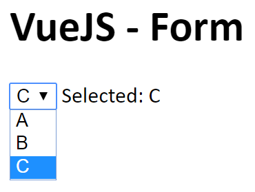

因為我們沒有另外設定 value，因此在 <option> 的內容自動會當成 value 值。

如果想要選單項目的「名稱」與「值」區分開來，只要增加 value 屬性即可：

    <option value="a">A</option>

修改結果：

    

        <select v-model="selected">
            <option value="a">A</option>
            <option value="b">B</option>
            <option value="c">C</option>
        </select>
        Selected: {{ selected }}
    

另外別忘了，data 的 selected 'B' 要改成小寫 'b'。

    new Vue({
        el: '.form-select',
        data: {
            selected: 'b'
        }
    });

實際畫面：

勾選別的項目時，值也會是小寫結果：

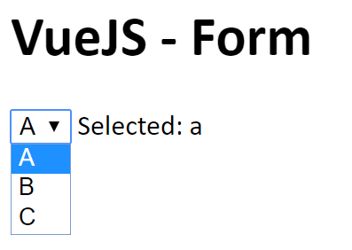

以上為透過資料綁定的方式，進行表單的元件操作。

### Next Stop：

### [Vue.js 2.0 - 帶著 Vue 框架闖蕩異世界 - ［4］為魔法上屬性吧](https://dotblogs.com.tw/explooosion/2017/07/30/193724)

有勘誤之處，不吝指教。ob'\_'ov