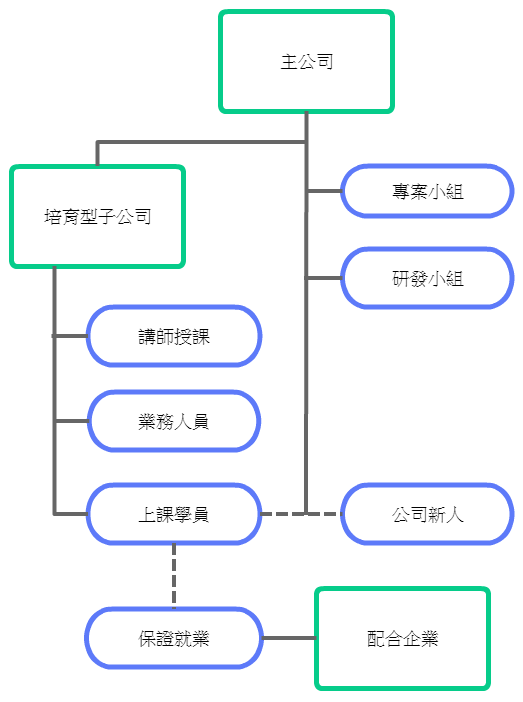

記錄著菜逼巴畢業生對於創業的感想...

一、前言預警
------

首先，預警一下，本篇僅只是一位剛大學畢業菜逼巴的人生筆記，

可能社會的大老前輩們，都會認為，年輕人還是乖乖地做好本分，

找一間公司好好養活自己比較實在。

這樣的思維並不好，可能比較適合一些對於人生觀不同角度的人，

工作畢竟只是一份工作，一樣米百樣人，

個人得出一句：「志不在此，但志在必得。」

由於自己對於每一間新創公司都很感興趣，包含了：

*   理念初衷動機
*   組織架構規劃

因此今天想把得出的構思記錄下來。

二、時間緣由
------

教授帶著正在尋找實習公司的學長姊，一同參訪公司，

很幸運地碰到教授，也提起這件事情，並問我要不要一同去。

剛好今天要參訪一間屬於「新創」公司，

當然也很期待地踏上「借尋學姊實習公司之名義真調查參訪新創公司」之路惹！

在教授與公司創辦團隊談吐聊天的過程中，也讓我有了不少延伸思維，

更棒的是，赫然發現團隊有請知名講者「[劉艾霖 Ai-Lin Liou](https://github.com/alincode)」講師，作為技術團隊顧問，

更嚇人的是... 這位艾霖老師居然也曾是咱教授的學生，_（十幾年前的事）_，

我都嚇得趕快五體投地惹 QQ

以下就不再講這些瑣碎事情。

三、組織架構
------

接下來是個人筆記中的重點，

對於新創公司的「發展結構組織」整理了一下想法。

### 三種核心創業組織架構：

1.  #### [產品主導分群式](#1)
    
2.  #### [培訓研發分群式](#2)
    
3.  #### [廣角策略培訓分群式](#3)
    

這三個是個人今天得出的想法，很可能多年以後的我看到，

一定會問：「這三小名詞」，好像很厲害？好像都自己講的一樣！？

噢！其實這只是個人冠上的名詞而已。

接下來分析一下這三種架構是什麼意思，

畢竟這只是一個早上聽完訪談的結果，正因為這只是個菜逼巴得出的結論，

更能單純分析想法，如果今天是一位老前輩，那可就不一樣了。

四、組織架構分析
--------

### **［產品主導分群式］**

個人稍微畫了一下組織架構：

##### 【起始】

其實這是最典型的組織架構，

當我們今天研發得出某一個產品，覺得他未來發展性很高，

也保有一定商業價值， [Business Model](http://wiki.mbalib.com/zh-tw/%E5%95%86%E4%B8%9A%E6%A8%A1%E5%BC%8F) 是不易被模仿取代的。

這時候就會跳出來成立團隊，以此產品為營運導向，

然後分為業務以及專案小組。

業務主要推廣此產品，為掌管客戶群，分析需求，

可能是典型的 Sales，也可能是 PM，

這裡的 PM 還可以拆成為：

*   Project Manager
    
*   Product Manager
    

在此沒有要探討如何區分，端看團隊以及人力資源的分配。

詳細可參考：[新創公司中的兩種 PM：Project Manager v.s. Product Manager](https://www.bnext.com.tw/article/37522/bn-2015-09-30-152923-50)

##### 【營運】

而專案小組，就是負責處理客戶專案的團隊，

這樣的分群可以很多組，

可能 A 組負責 M 類組客戶群；

可能 B 組負責 N 類組客戶群；

但專案都是以自家產品為系統導向，

這樣的團隊應該就是最顯而易見的。

比如今天公司創立了一項產品，最簡單舉例：ERP，

ERP 百百種，每家都在做，

但如果你的產品能夠確實對於企業的成長有達到顯著， 

那你就是贏家！

這時候就可以推廣自家開發的 ERP，

雖然是客製化系統，但離不開核心，

業務則是不斷地拓展，產品顧客開發。

##### 【優缺】

優點

*   或許對於草創期較容易虧轉盈
*   有自家產品收入穩定
*   每個案子時間成本較低

缺點

*   人才不易招募培育
*   使用技術較難以更新
*   容易產生連環脫離（備註1）

備註1

連環脫離：即小組某人脫離公司，整團可能跟著離開，或整團另行創業。

以上是針對「**產品主導分群式**」的說明分析。

### **［培訓研發分群式］**

組織架構圖下：

【起始】

個人認為多半應該會是發生在剛畢業的青年，

可以是已經找到了志同道合的夥伴，也可以是對於某些領域有共鳴的朋友，

可能有共同理念、設計或研發方向，

也許產品還沒順利發展出來，但仍在研發中。

這時候可能前期會以接案導向，畢竟生存優先，

上圖比較趨向於中期，當案子越來越多的時候，團隊往往較無時間進行研發，

這時候就可以區分為兩種：

*   專案小組
*   研發小組

【營運】

先說說研發小組，由於是研發自家產品，

通常都是由核心團隊進行，甚至可能聘請技術顧問等等。

然後部分的人員負責接案的處理，同時也是公司的維運，

畢竟同時你要穩定公司營運，也要開發客戶，即拓展客戶群。

在這邊個人提出的架構與一般較不同，

由於新創對於資金的需求較大，通常會尋找學校進行「產學合作」。

這時候，我們就可以透過這樣的機制，讓學生參與接案小組，

除了能讓學生提升實戰經驗，親身體驗**採坑洗臉**的感覺，又可以透過專案的方式，

讓學生更能了解職場運作、公司營運以及開發思維。

另外產學最大的好處，通常就是可以更親近你的部屬（學生），這裡的親近不一定是指相處融洽，

因為透過師長教授的密切聯絡溝通，可以更能知道學生在想些什麼，

當然也較能有更多溝通彈性。

當產學的學生畢業後，

學生可能會選擇離開，也可能留下，_（大部分應該都是離開）_，

這時候學生如果願意留下，轉正職就可以有兩種規劃：

*   擔任專案領導
*   參與研發小組

由於透過產學的關係，雖然學生多半可能會選擇離開，

但我們也有機會從中慰勞學生，一同加入公司繼續打拼，

通常願意留下的，都是對於公司的經營理念有認同，

但是如果公司本身文化差，或是對於產學上沒有處理完善，

口碑一但沒做好，**會很可怕的**，因為我親耳從以前公司前輩口中得知：

以前待的公司後來跟某科大進行產學合作，但其實公司部門氣氛**差**，

大概就是主管**出一張嘴**的意思，當然爾，學生回去一定會討論，

這麼差的評價，當然是沒有一個想留下來，每個人都在抱怨，

這是最壞的情況，也是都會可能發生的。_（雖然已發生）_

【優缺】

優點

*   公司對於研發較保有彈性空間
*   人事成本可降低
*   員工忠誠度較高

缺點

*   接案易使客戶群少的公司維運不穩
*   產學的競爭與投入成本
*   接案所花的時間成本較高

### **［廣角策略培訓分群式］**

**這**奇葩的名詞我們先喀一點 ......　

認真！　這我想了很久欸！！！

【起始】

首先這一張圖，是我最近看了很多因應市場需求所慢慢出現的行業，

大家都聽過巨匠電腦、聯成電腦，都聽過就業保證班，

好！結案。

沒錯，但差別在哪？

這裡我想提到的是，主公司依舊是有案子或是自家產品推廣等等，

這些保留不談，我們以公司已有穩定維運為前提（可能是接案或是產品推廣等等）

那麼為何要分支出「培育型子公司」呢？

拿網頁來說，Modern Web 的革命帶來了網頁人才的需求，

大量的需求使得大家會尋找能夠提供就業的機構，

這時候就會找上剛剛提到的兩家機構。

但這些機構我想有些人應該會有「**既定**」印象，

本人在此並不想戰，因此不詳細提。

由於網路社群的發展快速，訊息傳播容易，

我們可以常常看到有關網頁設計或是美術設計的課程訊息，

例如：[六角學院](http://www.hexschool.com/)、[五倍紅寶石](https://5xruby.tw/)、[好學校](https://hahow.in/) ...等等

以這類的經營方式去分支公司。

【營運】

好，說真的這樣搞也很累，畢竟要搞個學習機構也不容易。

因此我們以理想化的情境來談，

我想，如果對於技術有專研的人，應該都能體會，

國內也常常舉辦一些大型議會議程，例如：

*   [JSDC 2017](http://2017.jsdc.tw/)
*   [ModernWeb 2017](http://modernweb.tw/)

在這些議會中，常常可以看到一些知名講師，

這些講師可能本身是某公司的技術人員、總監、顧問，

甚至就是講師（意旨例如像是六角學院的講師）

所以，拉回來一下！

如果我們今天想分享教授技術，

也可以利用此營運的方式開班授課，尋找合作廠商，

透過一系列的授課方式，當圓滿結業後，即可與合作企業進行就業保證班，

由於透過課程，栽培人員又不傷成本，因為要繳學費啊！

對於學員的能力更能掌握，因此也可以透過結業的方式，

讓學員可有機會進入自家公司工作。

但現實，光是要推廣教育機構吸引學子就不容易了，

因此認為可以找學生暑假寒假的時間點，

光這兩個月，就可以開一系列的課程了，

利用社群的方式，也比較好招募_（已有案例）_，

甚至尋找學校，給予機會舉辦幾場免費分享會、體驗營，

或是舉辦夏季體驗營、衝刺班等等。

最典型的例子上述剛剛提到的公司都是，

但 ... 實際個人不知道，

我也不知道他們是否有另外部門專門接案或推廣自家產品等等，

也可能只是單純推廣教育而已。

不過這樣的組織架構，看起來比較是後期的公司，

通常比較適合追求新技術的公司，

甚至在技術領域具有一定地位的人，

都可以轉為以教育為主的工作也可以。

【優缺】

優點

*   人事成本低
*   員工忠誠度較高
*   公司名譽提升

缺點

*   發展階段較為後期
*   營運成本高
*   學員招募不易

五、後記
----

對自己說：「小子，你還太淺了。」

有勘誤之處，不吝指教。ob'\_'ov