牙起來台語是什麼意思？ | Yahoo奇摩知識+

##### **啊！別走！** 🤕

近期開始學習 [MongoDB](https://www.mongodb.com/)，

首先很感謝有學長的親囊教授，否則肯定要踩很多坑。

教你怎麼放竿，魚會不會上鉤就看自己臉了。

這篇適合從來沒有接觸過 MongoDB 的新手，

如果你已經初學過，建議不要看這篇文章。怕.jpg

否則你會牙起來。

一、MongoDB 是一種水果
---------------

認識之前要先知道他的 ICON：

 **... ... 。**

* * *

### 簡單介紹

*   MongoDB 官方圖示以一片葉子為主題

 LOGO 表示樹的節點 （葉子），簡單說就是樹狀結構。

*   [在MongoDB中存儲樹結構：代碼示例](https://www.codementor.io/slavko/storing-tree-structures-in-mongodb-example-code-du107tk8d)

由 [10gen](https://github.com/10gen) 團隊所開發出來的，是一種 [NoSQL](https://zh.wikipedia.org/zh-tw/NoSQL) 資料庫，

如果不懂 NoSQL（Not Only SQL） 可以參考：

*   [了解NoSQL不可不知的5項觀念](https://www.ithome.com.tw/news/92506)
*   [快速認識4類主流NoSQL資料庫](https://www.ithome.com.tw/news/92507)

MongoDB 屬於文件資料庫（Document Database），以文本方式儲存，

本身沒有 Schema，所以在架構上很好調整。（大數據表示：是知音）

與一般RDBMS資料庫（ [MySQL](https://www.mysql.com/)、[MSSQL](https://www.microsoft.com/zh-tw/sql-server/sql-server-2017)）等比較：

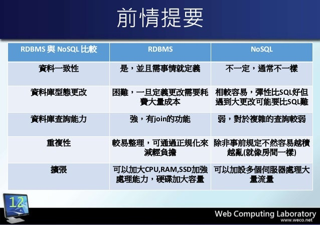

*   [宅學習 Firebase](https://www.slideshare.net/Weichungchai/firebase-70540522)

### 儲存格式

資料的儲存架構是以 [JSON](https://www.w3schools.com/js/js_json_intro.asp) 格式儲存，

如果使用 [Node.js](https://nodejs.org/en/) 做為後端，強烈建議使用 MongoDB。

    {
         _id: "948794777",
         name: "Robby",
         age: 30,
         email: "Robby",
         skill: [
                'javascript',
                'java'
        ]
    }

*   \_id：雖然稱為 NoSQL，但系統還是會自動幫你產生

二、MongoDB 下載
------------

前面廢話太多惹，這篇只是單純講解如何安裝。

首先到 [MongoDB Community Server Download](https://www.mongodb.com/try/download/community-kubernetes-operator) 下載，

在這邊請選擇「Select package」。

[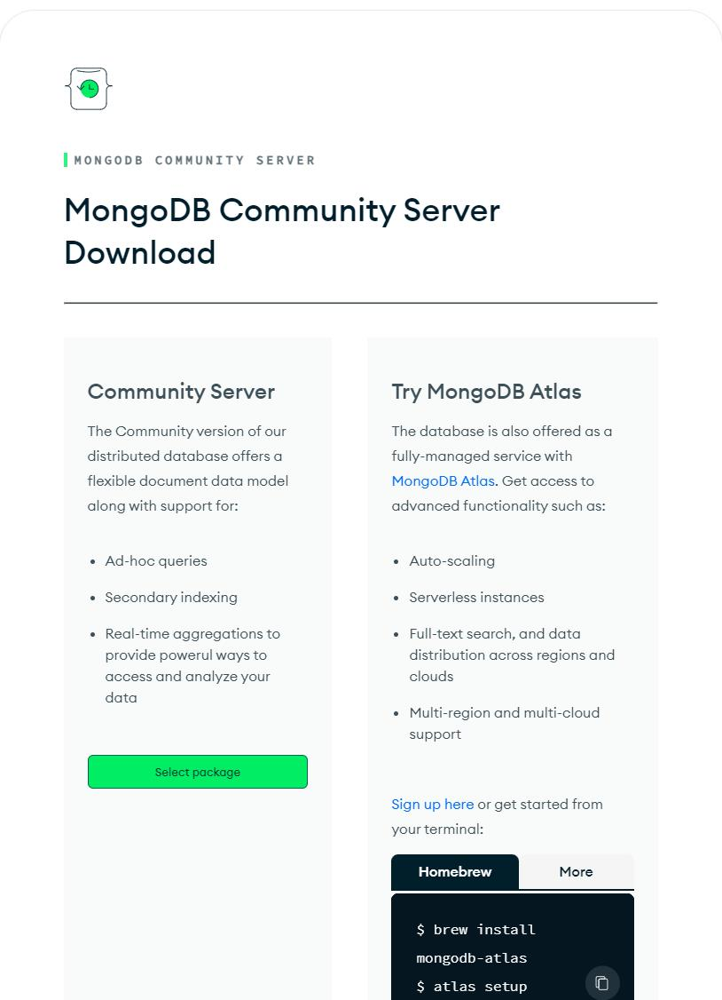](https://dotblogsfile.blob.core.windows.net/user/robby/05bd7822-877e-471e-8271-c5c48a46a9e1/1689505322.png.png)

找到自己的作業系統，並點選   Download 。

3.4.24 (含) 之後的版本不再支援 32 位元惹

執行。

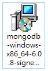

後續有步驟要取消勾選，請別油門踩到底！

歡迎你好你好歡迎，下一步（Next）。

[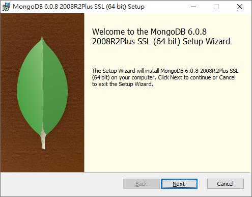](https://dotblogsfile.blob.core.windows.net/user/robby/05bd7822-877e-471e-8271-c5c48a46a9e1/1689505479.png.png)

勾選我同意，下一步（Next）。

[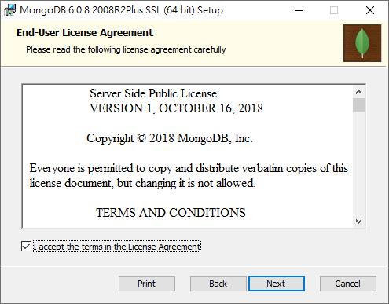](https://dotblogsfile.blob.core.windows.net/user/robby/05bd7822-877e-471e-8271-c5c48a46a9e1/1689505493.png.png)

安裝方式我們選擇自訂（Custom），下一步（Next）。

[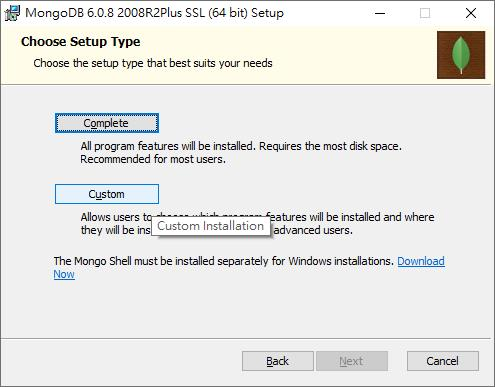](https://dotblogsfile.blob.core.windows.net/user/robby/05bd7822-877e-471e-8271-c5c48a46a9e1/1689505507.png.png)

安裝路徑默認即可，下一步（Next）。

    C:\Program Files\MongoDB\Server\3.6

[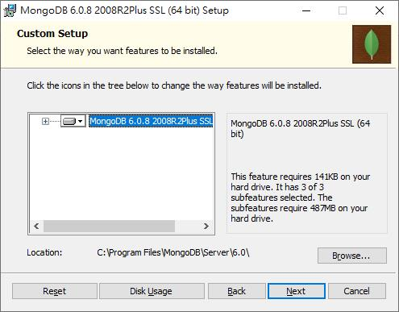](https://dotblogsfile.blob.core.windows.net/user/robby/05bd7822-877e-471e-8271-c5c48a46a9e1/1689505524.png.png)

重點部分！

請勿安裝 MongoDB Compass，取消勾選，否則會面臨到很多「[問題](https://www.google.com.tw/search?q=mongodb+compass+javascript+error&oq=MongoDB+Compass+java&aqs=chrome.1.69i57j0.1965j0j7&sourceid=chrome&ie=UTF-8)」，下一步（Next）。

[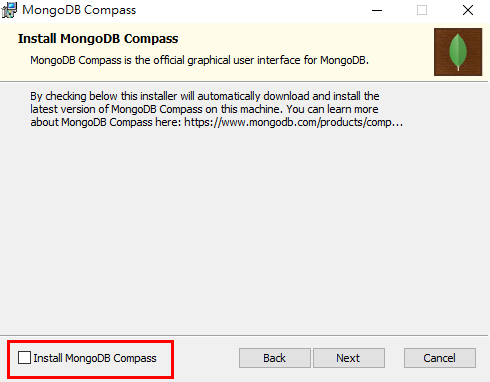](https://dotblogsfile.blob.core.windows.net/user/incredible/05bd7822-877e-471e-8271-c5c48a46a9e1/1516479415_94401.png)

然後就可以放心開始安裝（Install）。

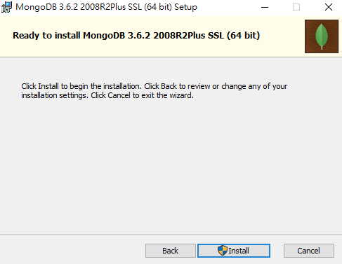

完成後直接點選完成（Finish）。

[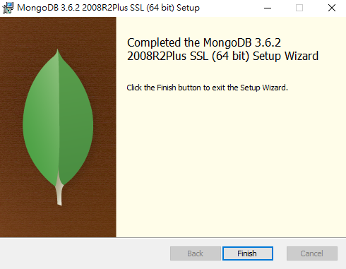](https://dotblogsfile.blob.core.windows.net/user/incredible/05bd7822-877e-471e-8271-c5c48a46a9e1/1516479658_84681.png)

將 MongoD 設置成背景服務運作。

在以前的版本需要手動安裝，筆者很久沒更新，這次回頭更新發現已經在安裝階段提供了這段設置！

預設勾選 Install MongoD as a Service，服務名稱預設，而資料和日誌位置可根據自己喜好修改。

筆者在這階段全部以預設配置，直接選擇下一步（Next）。

[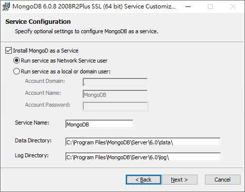](https://dotblogsfile.blob.core.windows.net/user/robby/05bd7822-877e-471e-8271-c5c48a46a9e1/1689505588.png.png)

手動取消勾選不安裝 [MongoDB Compass](https://www.mongodb.com/products/compass)，若有需要再勾選。

過去 2018 年本文章使用 MongoDB Compass 遇到一些問題沒特別研究與紀錄，

如今這些工具都是能正常運作，若有另外熟悉的工具，可於此階段取消安裝該選項。

安裝確認！

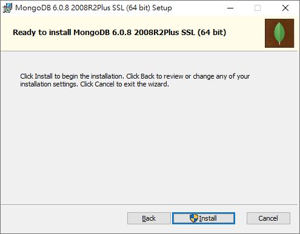

等待安裝完成！

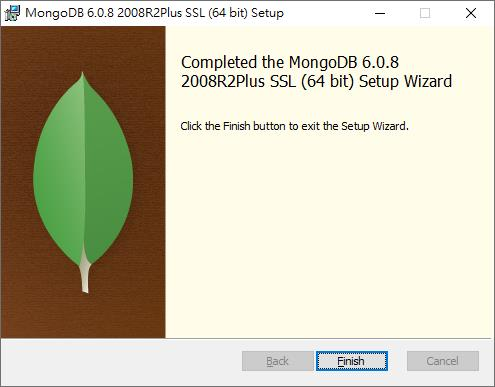

完成後請重新開機。

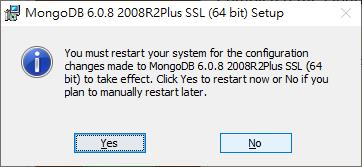

三、查看電腦服務
--------

在過去文章本文教學如何手動配置，如今最新的版本其實都已經在安裝過程配置好了！

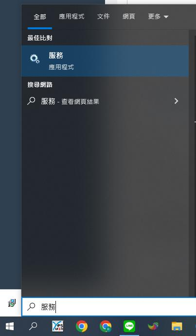

可以在［開始］查詢［服務］，找到 MongoDB Server (MongoDB)

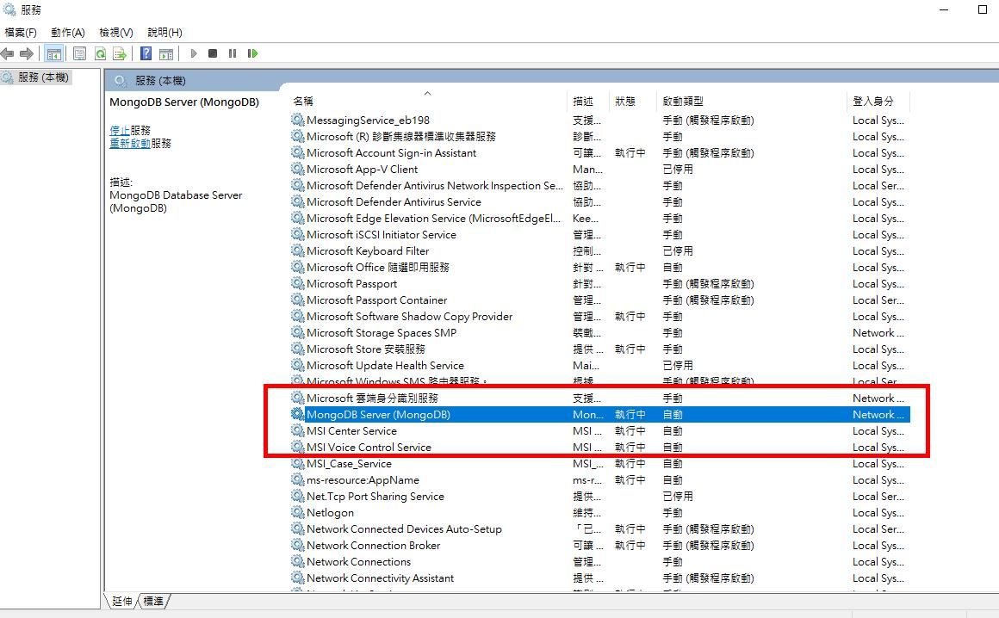

四、Robo 3T－GUI 管理工具
------------------

為了方便操作，本篇介紹 [Robo 3T](https://robomongo.org)，

選擇好版本並[下載](https://robomongo.org/download)。（請依電腦位元選擇）

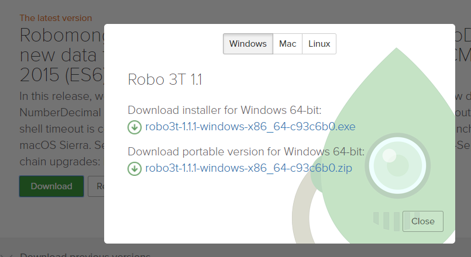

步驟的部分。

**摁 ... ... 。**

衝到底。

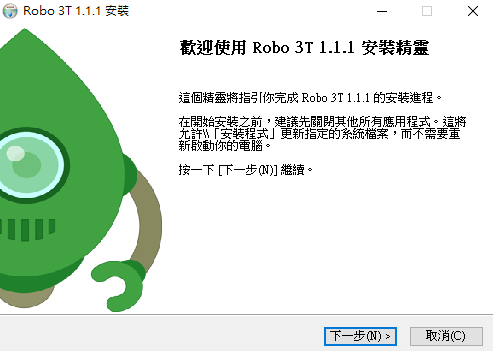

完成。

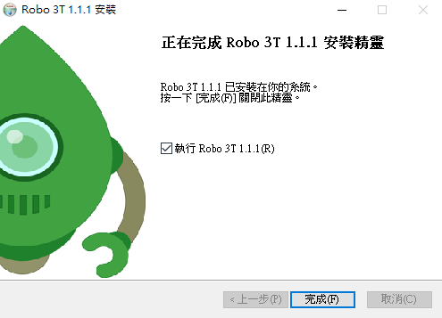

點選電腦圖案，建立連線，再點選「Create」。

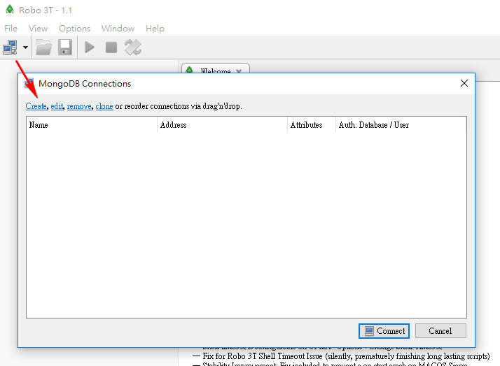

由於是連本地 localhost，因此通通默認，

然後點選「Test」，就可看到成功訊息！

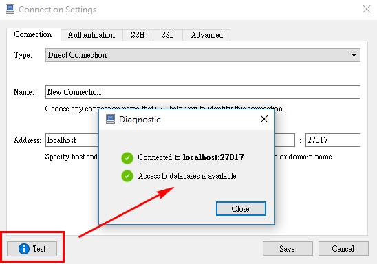

*   如果測試失敗，請確認是否服務已經啟用

選擇建立好的項目，連線吧！

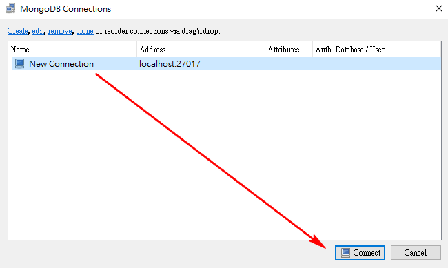

以上大功完成囉！

好好享受 MongoDB 的強大吧！

五、參考資料
------

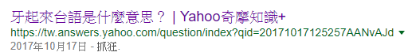

有勘誤之處，不吝指教。ob'\_'ov