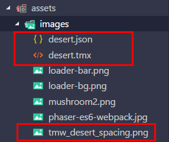
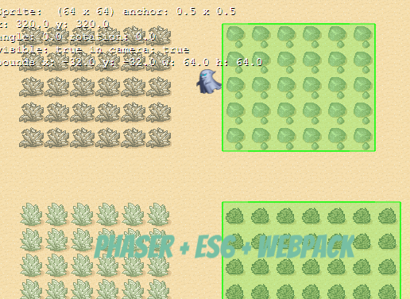
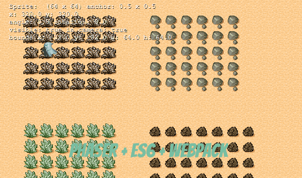
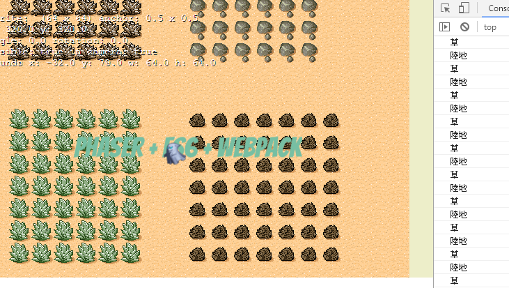

世界地圖！我的主場！~ 程式撰寫篇

上一篇說明了 Tiled 的建立與使用，

接下來要透過實作的方式，

將地圖放置於專案內。

本系列實作檔案放置於 Github 上：

*   ### **[phaser-tilemaps](https://github.com/explooosion/PhaserTutorial/tree/master/example/phaser-tilemaps)**
    

目錄引導

#### [上篇](https://dotblogs.com.tw/explooosion/2018/02/24/171424)

*   一、前置作業
*   二、建立新地圖

#### 本篇

*   三、專案建立
*   四、玩家與地圖碰撞

三、專案建立
------

### 新增專案

本範例使用 [lean](https://github.com/lean) **的整合專案 [phaser-es6-webpack](https://github.com/lean/phaser-es6-webpack)，**

Phaser + ES6 + Webpack

Clone repo。

    git clone https://github.com/lean/phaser-es6-webpack.git

Install dependencies。

    npm install

Run the development server

    npm run dev

執行後預設畫面：

### 地圖載入

將上一篇的地圖資源放入專案 assets ，一共三個檔案（tmx、png、json）

tmx 其實可以不需要了。

［assets / images］

［src / states / Splash.js］

接著編輯 Splash.js 檔案，在 preload 中的最後加上 load 資源。

    preload() {
    
      // ... 其他省略
    
      //
      // load your assets
      //
      this.load.image('mushroom', 'assets/images/mushroom2.png')
    
      // 載入地圖資源
      this.load.tilemap('map', 'assets/images/desert.json', null, Phaser.Tilemap.TILED_JSON)
      this.load.image('tiles', 'assets/images/tmw_desert_spacing.png')
    }

［src / states / Game.js］

編輯 Game.js 檔案，在 create 中添加地圖

    create() {
    
      // 新增地圖
      this.map = this.game.add.tilemap('map')
    
      // 新增圖塊 addTilesetImage( '圖塊名稱' , 'load 時png的命名' )
      this.map.addTilesetImage('tileset', 'tiles')
    
      // 建立圖層 (圖層名稱為 tile 中所設定)
      this.layer = this.map.createLayer('Layer')
      this.layer.resizeWorld()
    
      // 新增物理引擎 (後續會使用到, 在此不影響)
      this.game.physics.startSystem(Phaser.Physics.ARCADE)
    
      // .. 其他省略
    
    }

畫面結果如下：

四、玩家與地圖碰撞
---------

### 玩家建立

［assets / images］

為了後續能夠實現人物與地圖的碰撞偵測，

請準備一張角色圖片 32x32 pixcel，且為透明的 png 檔案，

可直接複製下圖使用，放置於 images 底下。

［src / states / Splash.js］

接著編輯 Splash.js 檔案，在 preload 中的最後加上 load 資源。

    preload() {
    
      // ... 其他省略
    
      //
      // load your assets
      //
      this.load.image('mushroom', 'assets/images/mushroom2.png')
    
      // 載入地圖資源
      this.load.tilemap('map', 'assets/images/desert.json', null, Phaser.Tilemap.TILED_JSON)
      this.load.image('tiles', 'assets/images/tmw_desert_spacing.png')
    
      // 玩家
      this.load.image('player', 'assets/images/player.png')
    }

在 Phaser 非 ES6 底下，如果要建立一個 [Sprite](https://phaser.io/docs/2.6.2/Phaser.Sprite.html)，會用以下方法，

當然要直接這樣寫也可以，但本範例遵循 ES6 作法，我們另外建立一個 class 吧 

    var player = game.add.sprite(200, 200, 'player');

［src / sprites / Player.js］

建立 Player.js 檔案。

    import Phaser from 'phaser'
    
    export default class extends Phaser.Sprite {
        constructor({ game, x, y, asset }) {
            super(game, x, y, asset)
    
            // 套用物理系統
            this.game.physics.arcade.enable(this)
    
            // 不可超出世界邊界
            this.body.collideWorldBounds = true
    
            // 監聽鍵盤按鍵
            this.cursors = this.game.input.keyboard.createCursorKeys()
        }
    
        update() {
    
            // 可透過鍵盤控制方向
            if (this.cursors.down.isDown) {
                this.body.velocity.y = +100
            } else if (this.cursors.left.isDown) {
                this.body.velocity.x = -100
            } else if (this.cursors.right.isDown) {
                this.body.velocity.x = 100
            } else if (this.cursors.up.isDown) {
                this.body.velocity.y = -100
            } else {
                this.body.velocity.x = 0
                this.body.velocity.y = 0
            }
        }
    }
    

*   physics.arcade：讓 Player 套用物理系統
*   collideWorldBounds： 是否限制於世界邊界內，即不可超出邊界外

［src / states / Game.js］

引入玩家 Player 類別。

    import Player from '../sprites/Player'

在 create 中加入玩家 Player。

因為蘑菇 mushroom 很**礙眼**，可以先把他註解掉。

    create(){
    
      // ... 其他省略
    
      // 可以先將蘑菇註解掉
      // this.game.add.existing(this.mushroom)
    
      // 新增玩家
      this.player = new Player({
        game: this.game,
        x: 100,
        y: 100,
        asset: 'player'
      })
    
      this.game.add.existing(this.player)
    
      // 鏡頭跟隨玩家
      this.game.camera.follow(this.player, Phaser.Camera.FOLLOW_LOCKON, 0.1, 0.1)
    
    }
    

玩家能夠透過方向鍵 ↑ ↓ ← → 自由移動，畫面結果如下：

### 碰撞偵測

［src / states / Game.js］

在 create 中加入玩家 Player。

    create(){
    
      // ... 其他省略
    
      // Add Map
      this.map = this.game.add.tilemap('map')
      this.map.addTilesetImage('tile', 'tiles')
      this.layer = this.map.createLayer('Layer');
      this.layer.resizeWorld()
    
      // 地圖碰撞區間
      this.map.setCollisionBetween(31, 32, true, this.layer)
      this.map.setCollisionBetween(46, 48, true, this.layer)
      this.layer.debug = true
    
      // ... 其他省略
    
    }
    

*   [setCollisionBetween](https://phaser.io/docs/2.4.4/Phaser.Tilemap.html)：在索引區間內，例如 46~48，為不可碰撞的，這裡的索引指的就是圖塊的 ID  
    當然也可以使用 setCollision 單一索引
*   layer.debug：利用 debug 模式，可以很清楚看到哪些物體具有限制的屬性

畫面結果，可以透過 debug 模式看到綠框為限制區域：

［src / states / Game.js］

由於只有限制沒有用，還要補上碰撞偵測。

    update() {
    
      // 碰撞
      this.game.physics.arcade.collide(this.player, this.layer)
    }

關掉 debug 模式再試試看，

可以發現往右邊移動到石塊區會無法再過去。

### 圖塊偵測

［src / states / Game.js］

利用 overlap 方式，偵測是否重疊。

    update() {
    
      // 碰撞
      this.game.physics.arcade.collide(this.player, this.layer)
    
    　// 重疊
      this.game.physics.arcade.overlap(this.player, this.layer, (player, layer) => {
        console.log(layer.properties.name)
      }, null, this)
    }

*   properties：這邊的屬性為 Tiled 中所新增的客製屬性

結果畫面，開啟 F12，可以看到訊息印出：

五、結語
----

### **乾，媽的！**

### 後來才知道有 **setCollisionBetween** 這東西可以用！！！

我一開始還對 layer 做 mapping，

Loop 所有圖塊，取得 x, y 然後放到 group 裡面，

再到地圖上建立對應位置的 sprite ，

想像一下畫面滿滿的 sprite（只是你看不見）

### **很卡！**

Phaser 好棒棒！喝勝！

參考資料：

*   [Learn Phaser](http://phaser.io/learn)
*   [dartdocs.org - setCollisionBetween](https://www.dartdocs.org/documentation/play_phaser/0.12.2/Phaser/Tilemap/setCollisionBetween.html)
    
*   [Phaser Arcade collision between sprite and layer not working](http://www.html5gamedevs.com/topic/19699-phaser-arcade-collision-between-sprite-and-layer-not-working/)
    

想再多琢磨一下？

### [回上一篇查看](https://dotblogs.com.tw/explooosion/2018/02/24/171424)

有勘誤之處，不吝指教。ob'\_'ov