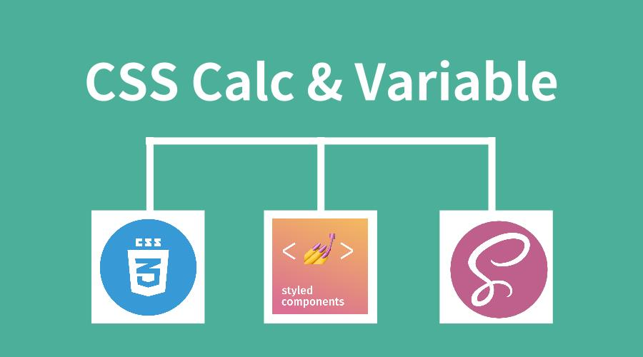
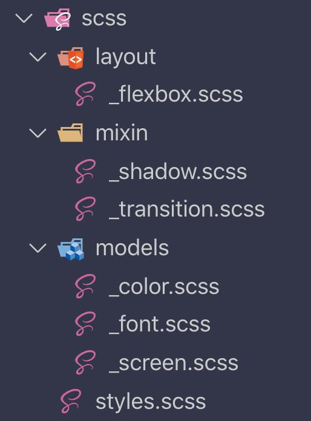

css calc 搭配變數的各種奇淫技巧！

有些經驗技巧，總在奇妙需求後。

前言
--

在 css 中，[calc](https://developer.mozilla.org/en-US/docs/Web/CSS/calc) 的技巧想必大家都相當熟悉。

面對排版、佈局設計時，相當好用。

而當你在寫 [scss](https://sass-lang.com/) 時，又多了好幾種解法，

如果你又使用了 [styled-components](https://styled-components.com/)，那麼使用情境就更多樣了。

本篇文章紀錄當要傳入 calc 計算的數值為「變數」的使用方式。

以下將從 css、scss 到 styled-components 依序介紹使用技巧。

ㄧ、CSS
-----

當我們想在 css 檔案內進行計算。

### 1\. 直白方法 ( HowHow Method )

[男人就是直白](https://www.youtube.com/watch?v=cruXUtlOdTU)，直接寫上數值，這是最入門的用法。

\[ Foo.css \]

    div {
      height: calc(100vh - 50px);
    }

你知道嗎？筆者尊重性別平等，因此「男人...」這句話不代表本人立場。

### 2\. 偽類別方法 ( Pseudo-elements Method )

根據偽類別 ( [Pseudo-elements](https://developer.mozilla.org/en-US/docs/Web/CSS/Pseudo-elements) ) ，你可以使用 [:root](https://developer.mozilla.org/en-US/docs/Web/CSS/:root)，來定義屬性與值。

然後利用 [var()](https://developer.mozilla.org/en-US/docs/Web/CSS/var) 方法來取出指定屬性的值。

\[ Foo.css \]

    :root {
      --head: 50px;
    }
    
    div {
      height: calc(100vh - var(--head));
    }

你知道嗎？在 :root 內定義的屬性名稱，必須是 \-- 開頭，例如：\--head。

你知道嗎？ :root 內的命名方式也可以搞死人，例如：\--\_\_-\_-\_，var(--\_\_-\_-\_)。

二、SCSS
------

當我們想在 scss 檔案內進行計算。

### 1\. 偽類別方法 ( Pseudo-elements Method )

此方法為 css 本身的方式，因此與你的預處理器 ( scss、sass、less ) 無關。

語法當然也都是一樣的。

\[ Foo.scss \]

    :root {
      --head: 50px;
    }
    
    div {
      height: calc(100vh - var(--head));
    }

你知道嗎？不少 css framework 經常使用 :root 來定義設計模式。

### 2\. 宣告變數方法 ( Variables )

當你使用 CSS 預處理器 ( [CSS Preprocessor](https://developer.mozilla.org/en-US/docs/Glossary/CSS_preprocessor) ) 時，想必最熟悉的就是變數宣告了。

如果要在 calc 放入變數，需要使用插值法 ( [Interpolation](https://sass-lang.com/documentation/interpolation) )，透過 # 與 { }，將變數包起來。

\[ Foo.scss \]

    $head: 50px;
    
    div {
      height: calc(100vh - #{$head});
    }

三、styled-components
-------------------

當專案使用 react ＋ styled-components，除了元素的主樣式會寫在 js 內：

    const Main = styled.main`
      width: 100px;
      color: #f00;
    `;

你可能也會有 scss 資料夾存放各類模組，例如：

那麼 calc 內的變數，可能會有幾種來源：

1.  來自 js 內定義的變數
2.  從 ThemeProvider 載入 scss 的變數
3.  從 ThemeProvider 載入 scss 的 :root
4.  不經過 ThemeProvider ，載入 scss 的變數
5.  不經過 ThemeProvider ，載入 scss 的 :root

我們先撇除最佳實踐，單純思考在這些情境下的處理方式。

讓我們開始分析囉！

### 1\. 來自 js 內定義的變數

由於 styled.div\` \` 是用樣板字串 ( [Template Strings](https://developer.mozilla.org/zh-TW/docs/Web/JavaScript/Reference/Template_literals) ) 包起樣式，因此可以使用 ${expression} 來包入變數。

第二種只是把 ${expression} 函式改寫成 [arrow function](https://developer.mozilla.org/zh-TW/docs/Web/JavaScript/Reference/Functions/Arrow_functions)。

第三種則是第二種的簡化，即 [arrow function](https://developer.mozilla.org/zh-TW/docs/Web/JavaScript/Reference/Functions/Arrow_functions) 的簡化版。

\[ Foo.js \]

    const head = '50px';
    
    const Foo = styled.div`
      height: calc(100vh - ${head});
    `;
    
    const Bar = styled.div`
      height: ${() => `calc(100vh - ${head})`};
    `;
    
    const App = styled.div`
      height: ${`calc(100vh - ${head})`};
    `;

### 2. 從 ThemeProvider 載入 scss 模組中的變數

基本上用法跟前面樣板字串一樣，只是變數來自 props 的 theme。

\[ Foo.js \]

    const Main = styled.main`
      height: ${p => `calc(100vh - ${p.theme.head})`};
    `;

### 3\. 從 ThemeProvider 載入 scss 模組中的 :root

:root 偽類別與 scss 無關，因此使用方式同 css 一樣。

\[ Foo.js \]

    const Main = styled.main`
      height: calc(100vh - var(--head));
    `;

### 4. 不經過 ThemeProvider ，載入 scss 的變數

由於不是從 Provider 倒入，無法從 props 中取出。

但可以透過 [css-loader](https://github.com/webpack-contrib/css-loader)，使用 [:export](https://github.com/css-modules/icss#export) 將變數以物件形式匯出。

如果是用框架諸如：react、angular、vue 等，基本上 webpack 已經都設定過囉！

以下示範如何將 head 變數匯出。

\[ Foo.scss \]

    $head: 50px;
    
    :export {
      head: $head;
    }
    

\[ Foo.js \]

    import { head } from './Foo.scss';
    
    const Main = styled.div`
      height: calc(100vh - ${head});
    `;

### 5\. 不經過 ThemeProvider ，載入 scss 的 :root

同樣 :root 與 scss 無關，因此也是直接使用。

\[ Foo.scss \]

    :root {
      --head: 50px;
    }

\[ Foo.js \]

    import './Foo.scss';
    
    const Main = styled.main`
      height: calc(100vh - var(--head));
    `;

以上整理一些 calc 讀取變數的方式，

但為了一致性，個人認為 :root 與 變數 最好選擇使用一種。

最後再分享一篇文章探討：

[Why we prefer CSS Custom Properties to SASS variables](https://codyhouse.co/blog/post/css-custom-properties-vs-sass-variables)

歡迎大家討論自己喜歡的使用方式！

有勘誤之處，不吝指教。ob'\_'ov