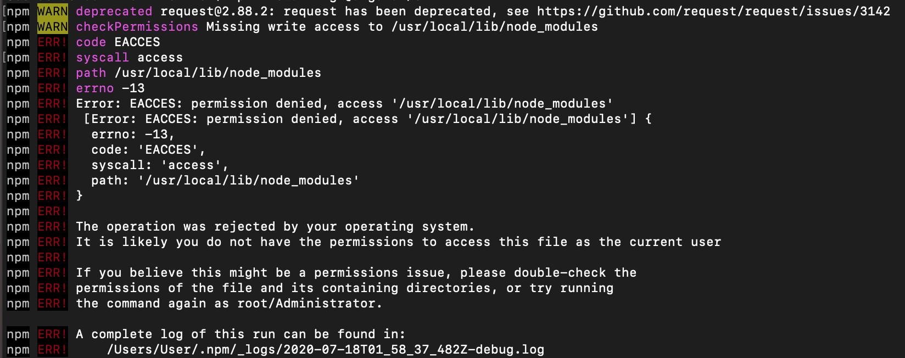

被守門員擋住，無法安裝 global package 啦！

每次在新環境中，難免還是會遇到新手村的問題。

前言
--

在新環境使用 npm 時，難免有些「新人問題」。

此處意旨，從 0 開始作業容易碰到的起始問題。 

故事是這樣發生的，

筆者在安裝全域套件 ( global package  ) 時，噴了一些錯誤導致安裝失敗。

    npm install <package-name> -g

粗估，應該是被守門員阻擋住 ...

並且收到訊息如下：

*   ref: [鎖鏈康妮](https://zh.moegirl.org/zh-tw/%E9%94%81%E9%93%BE%E5%BA%B7%E5%A6%AE)

欸不是。

錯誤訊息如下：

考過太多次英文閱讀測驗的你，

可以很明顯地抓出以下關鍵訊息：

1.  Missing write access to /usr/local/lib/node\_modules
2.  Error: EACCES: permission denied, access '/usr/local/lib/node\_modules'
    
3.  The operation was rejected by your operating system.
    
4.  try running npm ERR! the command again as root/Administrator.
    

簡單的說，就是沒有權限對目錄做寫入行為。

解決方式
----

根據錯誤訊息，可以知道套件安裝的目錄位置在：

    /usr/local/lib/node_modules

注意：此目錄為使用官網 [Node.js](https://nodejs.org/en/) 下載後的預設安裝路徑。

因此開啟 terminal，於任意目錄，輸入指令修改該目錄權限即可：

    sudo chown -R $USER /usr/local/lib/node_modules

由於修改存取權限等行為需要管理員身份，

因此下完指令後，電腦會要求輸入電腦用戶密碼，

將該目錄與其子目錄的擁有者，更改為當前電腦的用戶（對就是在講你）。

如此一來，

就算是全域安裝，有存取權限就沒問題了，對吧！？ （ [Ref](https://zh.wikipedia.org/zh-tw/%E5%B0%B1%E7%AE%97%E6%98%AF%E5%93%A5%E5%93%A5%EF%BC%8C%E6%9C%89%E6%84%9B%E5%B0%B1%E6%B2%92%E5%95%8F%E9%A1%8C%E4%BA%86%EF%BC%8C%E5%B0%8D%E5%90%A7) ）

果然再嘗試一次安裝套件，就沒問題了～

後記
--

如果你想知道這些片段指令是什麼意思 ...

筆者有份作業推薦，並且已經幫你做答完最後一題。

作答完畢後，相信一定可以知道的。

*   sudo：
*   chown -R：
*   $USER：
*   /usr/local/lib/node\_modules：
*   [鎖鏈康妮](https://zh.moegirl.org/zh-tw/%E9%94%81%E9%93%BE%E5%BA%B7%E5%A6%AE)：
    

有勘誤之處，不吝指教。ob'\_'ov