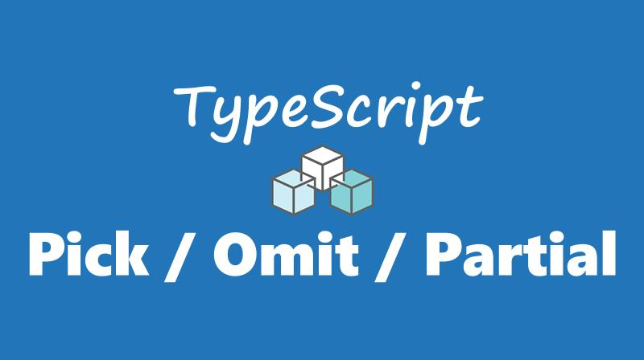

關於 interface 的特性應用！

又是值得探索 typescript 的日子 ~

前言
--

平常專案的開發上使用都 TypeScript，但其實用的範圍很淺，沒有太多的琢磨。

而近期在重構撰寫上心中冒出了一些問題，這些問題其實蠻新手向的。

這篇文章最感謝 [ChatGPT](https://chat.openai.com/)，在指引下找到關鍵字，進而翻閱到官方文件。

好耶！

本篇非常淺薄筆記用途，如果讀者有更多的興趣，可以直接參見官方文件：

https://www.typescriptlang.org/docs/handbook/utility-types.html

新手向前置作業
-------

在開始前可以先初始開發環境，讓環境能夠編譯 TypeScript。

    npm init -y

安裝 TypeScript 的定義管理工具。

    npm install --save-dev typescript ts-node
    

初始 tsconfig.json，預設配置不修改，如果有額外需求再自行設置。

    npx tsc --init

如果要編譯時，執行指令即可：

    npx tsc

下方是一段關於用戶的介面定義，文章的範例都會沿用此介面。

    interface Person {
      id: number;
      name: string;
      age: number;
      email: string;
      address: string;
      phoneNumbner: string;
    }

一、Pick 應用
---------

Pick<Type, Keys>

如果今天想基於這個介面，取出需要的屬性來定義新的介面，可以使用 [Pick](https://www.typescriptlang.org/docs/handbook/utility-types.html#picktype-keys)。

範例為定義一個介面，包含 name、age、email、address 4 種屬性。

    interface Person {
      id: number;
      name: string;
      age: number;
      email: string;
      address: string;
      phoneNumbner: string;
    }
    
    type PersonPreview = Pick<Person, "name" | "age" | "email" | "address">;
    
    const person: PersonPreview = {
      name: "Robby",
      age: 18,
      email: "robby@email.com",
      address: "my address",
    };

二、Omit 應用
---------

Omit<Type, Keys>

如果今天想基於這個介面，剔除不需要的屬性來定義新的介面，可以使用 [Omit](https://www.typescriptlang.org/docs/handbook/utility-types.html#omittype-keys)。

範例為定義一個介面，從 Person 介面中去除了 id、phoneNumber 後，剩餘的 4 種屬性。

    interface Person {
      id: number;
      name: string;
      age: number;
      email: string;
      address: string;
      phoneNumbner: string;
    }
    
    type PersonPreview = Omit<Person, "id" | "phoneNumbner">;
    
    const person: PersonPreview = {
      name: "Robby",
      age: 18,
      email: "robby@email.com",
      address: "my address",
    };

三、Partial 應用
------------

Partial<Type>

[Partial](https://www.typescriptlang.org/docs/handbook/utility-types.html#partialtype) 用於定義介面是允許非必填的，這裡所指的是將原本屬性賦予 undefined 型別，不包含 null！

今天情境為定義一個介面用於新增用戶，可以延續使用 Person 來完成這個新介面定義。

在下方例子中：

1.  若 name、email 為必填，可使用 Pick 來抽出所需屬性。
2.  若除了 name、email，其餘屬性皆可必填，我們可使用 Partial。
3.  由於 id 不應該被視為 request body 提交，因此使用 Omit 去除 id。

    interface Person {
      id: number;
      name: string;
      age: number;
      email: string;
      address: string;
      phoneNumbner: string;
    }
    
    type CreatePersonRequest = Pick<Person, "name" | "email"> &
      Partial<Omit<Person, "id">>;
    
    const person: CreatePersonRequest = {
      name: "Robby",
      email: "robby@email.com",
    };
    

四、延伸思考
------

到目前為止其實範例都很簡單，在官方文件 [Utility Types](https://www.typescriptlang.org/docs/handbook/utility-types.html) 都能找到！

而筆者在 Partial 的例子中有了新疑惑！？

對於 CreatePersonRequest 賦予了必填：

    Pick<Person, "name" | "email">

而我們卻在 Partial 只替除了 id，意味著 name、email 是非必填：

    Partial<Omit<Person, "id">>

關於非必填的設定，嚴格上做法是這三個屬性去除：

    Partial<Omit<Person, "id" | "name" | "email">>

那為何我們最初的例子結果卻是必填？？？

    type CreatePersonRequest = Pick<Person, "name" | "email"> &
      Partial<Omit<Person, "id">>;

### 交叉型別

[交叉型別，Intersection Types](https://en.wikipedia.org/wiki/Intersection_type#Intersection_of_a_type_family)：

> 在交叉型別中，如果有相同的屬性，則該屬性必須符合所有相關型別的規則。

這是因為在這裡使用了「&」作為結合，名詞稱之為「[交叉型別，Intersection Types](https://en.wikipedia.org/wiki/Intersection_type#Intersection_of_a_type_family)」。

在這個情況下，即使 name 和 email 在 Partial<Omit<Person, "id">> 這個型別中是可選的，

但是由於他們在 Pick<Person, "name" | "email"> 型別中是必填的，所以在 CreatePersonRequest 中也是必填的。

換句話說：

可以把它看作是 "更嚴格" 的規則（也就是必填）優先於 "更寬鬆" 的規則（也就是可選）。

這是 TypeScript 的 Intersection Types 的行為。

### 延伸例子

一些關於 Intersection Types 的例子：

在這個範例中，型別 C 是型別 A 和 B 的交叉型別，因此它將有兩個屬性：一個數字型別的 a 屬性，和一個字串型別的 b 屬性。

    type A = {
      a: number;
    };
    
    type B = {
      b: string;
    };
    
    type C = A & B;
    
    let c: C = {
      a: 1,
      b: "hello"
    };
    

如果在兩個型別中都有相同的屬性，而其中一個是必須的，另一個是可選的，則結果型別將會是必須的。

    type A = {
      a: number;
    };
    
    type B = {
      a?: number;
    };
    
    type C = A & B;
    
    let c: C = { a: 1 }; // Correct
    let c2: C = {}; // Error, property 'a' is missing in type '{}'
    

在交叉型別中，如果有相同的屬性但是型別不一致，則該屬性必須符合所有相關型別的規則。

這個例子中，型別 C 會導致一個錯誤，因為 a 在 A 中是 number 型別，而在 B 中是 string 型別。

    type A = {
      a: number;
    };
    
    type B = {
      a: string;
    };
    
    type C = A & B;
    

### 維基百科

筆者在前端領域上接觸較深，對於後端或強型別語言的一些名詞或特性相對生疏。

關於 [Intersection Types](https://en.wikipedia.org/wiki/Intersection_type#Intersection_of_a_type_family)  可以在維基百科看到更多擁有此特性的語言：

有勘誤之處，不吝指教。ob'\_'ov